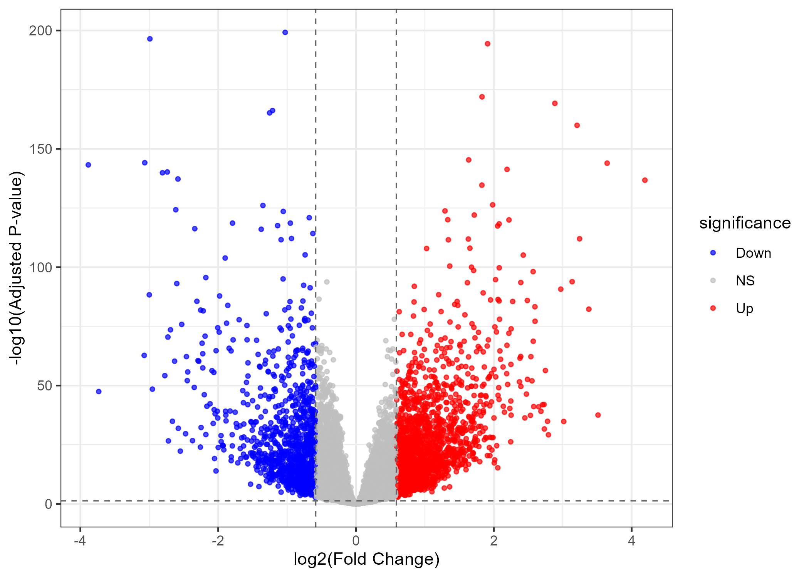
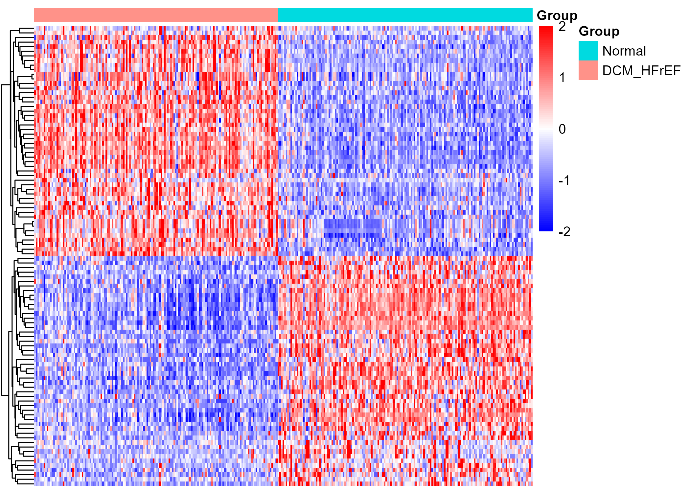

```{r setup, include=FALSE, warning=FALSE}
knitr::opts_chunk$set(
  echo = TRUE,
  warning = FALSE,
  message = FALSE,
  fig.dpi = 300,
  fig.align = "center"
)

options(timeout = 36000)
options(stringsAsFactors = FALSE)
options(download.file.method = "curl")
options(download.file.extra = "-k -L")

options(BioC_mirror = "https://mirrors.tuna.tsinghua.edu.cn/bioconductor")
options(repos = c(CRAN = "https://mirrors.tuna.tsinghua.edu.cn/CRAN/"))
```

---

# Differentially Expressed Genes (DEGs) 

We performed differential expression analysis using the DESeq2 package [@love2014DESeq2]. We constructed a DESeqDataSet object from the normalized gene count matrix and sample phenotype information, with disease status (HFrEF vs. Normal) as the design variable. We then estimated dispersion parameters and fitted a negative binomial distribution model for each gene, followed by a generalized linear model and an empirical Bayes shrinkage of log2 fold changes (log2FC). Finally, we used Wald tests to compute P‑values and adjusted them using the Benjamini‑Hochberg method to obtain padj. Differentially expressed genes were defined as those with |log2FC| ≥ 0.585 and padj < 0.05.

## Load Packages
```{r}
library(tidyverse)
library(data.table)
library(openxlsx)
library(patchwork)
library(vegan)
library(GEOquery)
library(limma)
library(DESeq2)
library(edgeR)
library(sva)
library(org.Hs.eg.db)
library(ashr)
library(RColorBrewer)
library(pheatmap)
```

## Step 1: Loading Data
```{r}
rm(list = ls())
load("../data/processed/geo/GSE141910/GSE141910_preprocessed_final.RData")
```

---

## Step 2: dds
```{r}
pheno_final$group <- factor(pheno_final$group, levels = c("Normal", "DCM_HFrEF"))
pheno_final$gender <- factor(pheno_final$gender, levels = c("Female", "Male"))
pheno_final$race <- factor(pheno_final$race, levels = c("AA", "Caucasian"))

# dds <- DESeqDataSetFromMatrix(countData = counts_final, colData = pheno_final, design= ~ SVA1 + SVA2 + SVA3 + age + gender + race + group)
dds <- DESeqDataSetFromMatrix(countData = counts_final, colData = pheno_final, design= ~ SVA1 + age + gender + race + group)


colData(dds)$age_scaled <- scale(colData(dds)$age)
# design(dds) <- ~ SVA1 + SVA2 + SVA3 + age_scaled + gender + race + group

design(dds) <- ~ SVA1  + age_scaled + gender + race + group

keep <- rowSums(counts(dds) >= 10) >= 3
dds <- dds[keep, ]

dds <- DESeq(dds)

save(dds,file = "../data/processed/geo/GSE141910/dds.Rdata")
```

---

## Step 3: HFrEF vs Normal
```{r}
load("../data/processed/geo/GSE141910/dds.Rdata")
res <- results(dds, contrast = c("group", "DCM_HFrEF", "Normal"))

res <- lfcShrink(dds, contrast = c("group", "DCM_HFrEF", "Normal"), res = res, type = "ashr")
```

---

## Step 4: DEGs
```{r}
# plotMA(res) 
# plotDispEsts(dds)

lfc <- log2(1.5)

deg_all <- as.data.frame(res)
deg_up <- deg_all %>% filter(padj < 0.05, log2FoldChange > lfc)
deg_down <- deg_all %>% filter(padj < 0.05, log2FoldChange < -lfc)

cat("The number of all DEGs:", nrow(deg_all), "\n")
cat("The number of up DEGs:", nrow(deg_up), "\n")
cat("The number of down DEGs:", nrow(deg_down), "\n")
```

---

##  Step 5: Volcano Plot
```{r}
deg_all$significance <- ifelse(
  deg_all$padj < 0.05 & abs(deg_all$log2FoldChange) > lfc,
  ifelse(deg_all$log2FoldChange > lfc, "Up", "Down"), "NS")

p_volcano <- ggplot(deg_all, aes(x = log2FoldChange, y = -log10(padj), color = significance)) +
  geom_point(alpha = 0.7, size = 1) +
  scale_color_manual(values = c("blue", "gray", "red")) +
  geom_vline(xintercept = c(-lfc, lfc), linetype = "dashed", color = "gray40", linewidth = 0.4) +
  geom_hline(yintercept = -log10(0.05), linetype = "dashed", color = "gray40", linewidth = 0.4) +
  theme_bw(base_size = 10) +
  labs(
    # tag = "A",
    x = "log2(Fold Change)", 
    y = "-log10(Adjusted P-value)") +
  theme_bw() + theme(
    plot.title = element_text(hjust = 0.5),
    # plot.tag.position = c(0.01, 0.98),
    # plot.tag = element_text(size = 12, face = "bold")
  )

ggsave("Figure_2A_deg_volcano.pdf",plot = p_volcano,path = "../results/figures/main",device = "pdf", width = 7,height = 5,dpi = 300)

ggsave("Figure_2A_deg_volcano.png", plot = p_volcano, path = "../results/figures/main", device = "png", width = 7, height = 5, dpi = 300)
```

---

## Step 6: Heatmap
```{r}
deg_sig <- deg_all %>% filter(padj < 0.05, abs(log2FoldChange) > lfc)

N_top <- 50

up_top <- deg_sig %>%
  filter(log2FoldChange > 0) %>%
  arrange(desc(log2FoldChange)) %>%
  head(N_top)

down_top <- deg_sig %>%
  filter(log2FoldChange < 0) %>%
  arrange(log2FoldChange) %>%
  head(N_top)

heat_genes <- c(rownames(up_top), rownames(down_top))

sample_order <- pheno_final %>%
  rownames_to_column("sample_id") %>%
  arrange(desc(group)) %>%  
  pull(sample_id)

vsd <- vst(dds, blind = FALSE)
mat <- assay(vsd)[heat_genes, sample_order]

mat_z <- t(scale(t(mat)))

breaks <- seq(-2, 2, length.out = 100)
palette <- colorRampPalette(c("blue", "white", "red"))(99)

anno_col <- data.frame(
  Group = pheno_final[sample_order, "group"]
)
rownames(anno_col) <- sample_order

p_heat <-pheatmap(
  mat_z,
  annotation_col = anno_col,
  color = palette,
  breaks = breaks,
  scale = "none",
  show_rownames = FALSE,
  show_colnames = FALSE,
  treeheight_row = 20,
  treeheight_col = 0,
  cluster_cols = FALSE,
  border_color = NA,
  fontsize = 10,
  width = 7,
  height = 5
)

ggsave("Figure_2B_DEG_heatmap_Plot.pdf",plot = p_heat,path = "../results/figures/main",device = "pdf", width = 7,height = 5,dpi = 300)

ggsave("Figure_2B_DEG_heatmap_Plot.png",plot = p_heat,path = "../results/figures/main",device = "png", width = 7,height = 5,dpi = 300)
```

## Step 7: Saving DEGs Results
```{r}
save(deg_all,deg_sig,deg_up, deg_down, lfc, file = "../data/processed/geo/GSE141910/degs_results.Rdata")

write.xlsx(
  list(
    DEG_All = deg_all,
    DEG_Sig = deg_sig
  ),
  file = "../results/tables/supplementary/Table_S4_DEG_Results.xlsx",
  overwrite = TRUE,
  rowNames = TRUE
)
```

## Step 8: Results

Differential expression analysis was performed on 21,572 genes using DESeq2. Genes with |log2FoldChange| > log₂(1.5) (i.e., absolute fold change > 1.5) and adjusted P value (padj) < 0.05 were considered significantly differentially expressed. Differential expression analysis of 21,572 genes was conducted via DESeq2. Genes satisfying the thresholds of \(|\log_2\text{FoldChange}| > \log_2(1.5)\) and adjusted P value (padj) < 0.05 were defined as significant differentially expressed genes (DEGs). In total, 3,188 DEGs were screened, consisting of 1,986 upregulated and 1,202 downregulated genes.
The number of upregulated genes was obviously predominant, reflecting robust activation of inflammatory response, immune function and cellular stress injury-related pathways in HFrEF myocardium. By contrast, fewer genes exhibited decreased expression, among which protective functional genes, metabolic regulators and tissue structural genes were largely suppressed.
Highly expressed upregulated genes contained COL22A1 (\(\log_2\text{FC}=4.23\)), SEZ6L (\(3.69\)), TNMD (\(3.38\)), SFRP4 (\(3.22\)), PENK (\(3.20\)), FHAD1-AS1 (\(3.16\)), HBD (\(3.07\)), LYPD1 (\(3.03\)), LAMP5 (\(3.03\)) and CAPN6 (\(2.96\)), which predominantly participate in extracellular matrix remodeling, neuropeptide signaling and cellular stress response. In contrast, downregulated genes were mainly implicated in inflammatory modulation, substance metabolism, ion transport and epithelial differentiation. Representative downregulated genes included IL1RL1 (\(\log_2\text{FC}=-3.88\)), SERPINA3 (\(-3.23\)), RNASE2 (\(-3.07\)), PI15 (\(-3.04\)), LOC105378356 (\(-3.01\)), FAM83B (\(-3.01\)), OVOS2P (\(-3.00\)), LCN6 (\(-2.99\)), TUBA3E (\(-2.87\)) and LBP (\(-2.85\)).  The volcano plot and heatmap of all DEGs are shown in @fig-2 A and B, respectively. 

::: {#fig-2}

  
   
  
Differential gene expression analysis.
A: Volcano plot showing the distribution of all expressed genes. Red dots represent significantly upregulated genes, blue dots represent significantly downregulated genes, and gray dots represent non-significant genes.
B: Heatmap displaying the expression patterns of the top 100 upregulated and top 100 downregulated DEGs. Samples are arranged with heart failure samples on the left and normal samples on the right. 

:::

---

# Weighted Gene Co-expression Network Analysis (WGCNA)


---

## Load packages
```{r}
library(WGCNA)
library(tidyverse)
library(ggvenn)
library(corrplot)
library(flashClust)
library(robustbase) 
library(dynamicTreeCut)
```

---

## Step 1: Loading Data
```{r}
rm(list = ls())

proc_dir <- "../data/processed/geo/GSE141910"
load(file.path(proc_dir, "GSE141910_preprocessed_final.RData"))

# Sample (row) x  Gene(column)

dat <- expr_fpkm_corr

common_samples <- intersect(colnames(dat), rownames(pheno_final))
dat <- dat[, common_samples, drop = FALSE]
pheno_final <- pheno_final[match(common_samples, rownames(pheno_final)), , drop = FALSE]

if (ncol(dat) == nrow(pheno_final)) {
  datExpr <- as.data.frame(t(dat))
} else if (nrow(dat) == nrow(pheno_final)) {
  datExpr <- as.data.frame(dat)
} else {
  stop("Error: Sample dimension mismatch between expression matrix and phenotype data.")
} 
rownames(datExpr) <- common_samples

# sampleTree
sampleTree <- hclust(dist(datExpr), method = "average")
plot(sampleTree, main = "Sample clustering", cex = 0.6)

clust_dynamic <- cutreeDynamic(
  sampleTree, 
  distM = as.matrix(dist(datExpr)),
  deepSplit = 1, 
  minClusterSize = 5
)

tab <- table(clust_dynamic)
singleton_clusters <- as.numeric(names(tab)[tab <= 2])
out_dynamic <- rownames(datExpr)[clust_dynamic %in% singleton_clusters]

cat("Outlier：", out_dynamic, "\n")

# PCA
pca <- prcomp(datExpr, center = TRUE, scale. = TRUE)
pca_df <- data.frame(
  PC1 = pca$x[, 1],
  PC2 = pca$x[, 2],
  Sample = rownames(datExpr),
  Group = pheno_final$group
)

pc_scores <- pca$x[, 1:2]

ggplot(pca_df, aes(x = PC1, y = PC2, color = Group, label = Sample)) +
  geom_point(size = 3) + 
  geom_text(vjust = -0.5, size = 3) +
  theme_minimal() +
  ggtitle("PCA of samples before outlier removal")

remove_samples <- c("GSM4216132", "GSM4216142")
datExpr <- datExpr[!rownames(datExpr) %in% remove_samples, , drop = FALSE]
pheno_final <- pheno_final[!rownames(pheno_final) %in% remove_samples, , drop = FALSE]


# goodSamplesGenes
gsg <- goodSamplesGenes(datExpr, verbose = 3)

if (!gsg$allOK) {
  # Remove abnormal genes
  if (sum(!gsg$goodGenes) > 0) {
    printFlush(paste("Removing genes:", paste(names(datExpr)[!gsg$goodGenes], collapse = ",")))
  }
  # Remove abnormal samples
  if (sum(!gsg$goodSamples) > 0) {
    printFlush(paste("Removing samples:", paste(rownames(datExpr)[!gsg$goodSamples], collapse = ",")))
  }
  # Update matrix (retaining only normal samples and genes)
  datExpr <- datExpr[gsg$goodSamples, gsg$goodGenes]
}

gene_mad <- apply(datExpr, 2, mad, na.rm = TRUE) 

# Select the top n genes with the largest variation
N_top <- 5000
n_select <- min(N_top, ncol(datExpr))   
selected_genes <- names(sort(gene_mad, decreasing = TRUE)[1:n_select])

datExpr <- datExpr[, selected_genes]
cat("Retain the number of highly variable genes：", ncol(datExpr), "\n")


# datTraits
datTraits <- pheno_final %>%
  dplyr::select(group) %>%
  mutate(
    Normal = ifelse(group == "Normal", 1, 0),
    DCM_HFrEF = ifelse(group == "DCM_HFrEF", 1, 0)
  ) %>%
  dplyr::select(-group) 

rownames(datTraits) <- rownames(pheno_final)

save(datTraits,datExpr,file = "../data/processed/geo/GSE141910/datExpr.Rdata")
```

---

## Step 2: Select soft threshold

```{r}
load("../data/processed/geo/GSE141910/datExpr.Rdata")

R2 <- 0.80

enableWGCNAThreads()
powers <- c(c(1:10), seq(from = 12, to=20, by=2))
sft <- pickSoftThreshold(
  datExpr, 
  RsquaredCut = R2,
  powerVector = powers, 
  verbose = 5
)
disableWGCNAThreads()

sft$fitIndices[, 1]
sft$fitIndices[, 2]
sft$fitIndices[, 5]

power <- sft$powerEstimate
power
# The average connectivity of WGCNA is above several tens (such as>50) to ensure that the network has sufficient edges
sft$fitIndices[power, 5]

save(sft,file="../data/processed/geo/GSE141910/sft.Rdata")

pdf("../results/figures/supplementary/Figure_S2_Soft_Threshold.pdf", width = 12, height = 5)

par(mfrow = c(1,2))
plot(sft$fitIndices[,1], -sign(sft$fitIndices[,3])*sft$fitIndices[,2],
     xlab="Soft Threshold (power)", ylab="Scale Free Topology Model Fit,signed R^2",
     type="n", main = paste("Scale independence"))
text(sft$fitIndices[,1], -sign(sft$fitIndices[,3])*sft$fitIndices[,2],
     labels=powers, col="red")
abline(h=R2, col="blue")

plot(sft$fitIndices[,1], sft$fitIndices[,5],
     xlab="Soft Threshold (power)", ylab="Mean Connectivity", type="n")
text(sft$fitIndices[,1], sft$fitIndices[,5], labels=powers, col="red")

dev.off()

sft$powerEstimate

pdf("../results/figures/supplementary/Figure_S2_Soft_Threshold.png", width = 12, height = 5)

par(mfrow = c(1,2))
plot(sft$fitIndices[,1], -sign(sft$fitIndices[,3])*sft$fitIndices[,2],
     xlab="Soft Threshold (power)", ylab="Scale Free Topology Model Fit,signed R^2",
     type="n", main = paste("Scale independence"))
text(sft$fitIndices[,1], -sign(sft$fitIndices[,3])*sft$fitIndices[,2],
     labels=powers, col="red")
abline(h=R2, col="blue")

plot(sft$fitIndices[,1], sft$fitIndices[,5],
     xlab="Soft Threshold (power)", ylab="Mean Connectivity", type="n")
text(sft$fitIndices[,1], sft$fitIndices[,5], labels=powers, col="red")

dev.off()

```

## Step 3: Construct a co-expression network

---

```{r}
load("../data/processed/geo/GSE141910/sft.Rdata")

load("../data/processed/geo/GSE141910/datExpr.Rdata")

enableWGCNAThreads()

set.seed(123)

net <- blockwiseModules(
  datExpr,
  # power = sft$powerEstimate,
  power = 6,
  TOMType = "unsigned",
  minModuleSize = 30,         
  mergeCutHeight = 0.25,
  deepSplit = 3,
  pamStage = TRUE, 
  pamRespectsDendro = FALSE,
  corType = "pearson",  
  saveTOMs = FALSE,
  verbose = 3
)
disableWGCNAThreads()

save(net,file = "../data/processed/geo/GSE141910/net.Rdata")
```

## Step 4: Clustering

---

```{r}
load("../data/processed/geo/GSE141910/net.Rdata")
load("../data/processed/geo/GSE141910/datExpr.Rdata")

moduleColors <- net$colors
table(moduleColors)

trait <- datTraits$DCM_HFrEF   
gene_cor <- cor(datExpr, trait, use = "pairwise.complete.obs")
GS <- abs(gene_cor)
mean_GS <- tapply(GS, moduleColors, mean)
print(sort(mean_GS))

mergedColors <- net$colors
table(mergedColors)

pdf("../results/figures/main/Figure_3A_Cluster_wgcna.pdf", width = 12, height = 5)
plotDendroAndColors(
  net$dendrograms[[1]],
  mergedColors[net$blockGenes[[1]]],
  "Module colors",
  dendroLabels = FALSE,
  hang = 0.03,
  addGuide = TRUE,
  guideHang = 0.05
)
dev.off()

pdf("../results/figures/main/Figure_3A_Cluster_wgcna.png", width = 12, height = 5)
plotDendroAndColors(
  net$dendrograms[[1]],
  mergedColors[net$blockGenes[[1]]],
  "Module colors",
  dendroLabels = FALSE,
  hang = 0.03,
  addGuide = TRUE,
  guideHang = 0.05
)
dev.off()
```

## Step 5: Module correlation with diseases

Module-Trait Correlation: 模块特征基因（eigengene）与性状（如 DCM_HFrEF）的相关系数. 衡量整个模块的表达模式与性状的线性关联强度。正相关表示模块高表达与疾病相关，负相关表示低表达与疾病相关

mean_GS: 模块内所有基因与性状相关系数的平均值. 反映模块内基因整体与性状关联的强弱，是对模块内基因个体相关性的汇总。

---

```{r}
load("../data/processed/geo/GSE141910/net.Rdata")
load("../data/processed/geo/GSE141910/datExpr.Rdata")

moduleLabels <- net$colors
moduleColors <- labels2colors(moduleLabels)
names(moduleColors) <- colnames(datExpr)

MEs <- net$MEs
geneTree <- net$dendrograms[[1]]

MEs_col <- moduleEigengenes(datExpr, moduleColors)$eigengenes
MEs <- orderMEs(MEs_col)

moduleTraitCor <- cor(MEs, datTraits, use = "p")
moduleTraitPvalue <- corPvalueStudent(moduleTraitCor, nrow(datExpr))

textMatrix <- paste(signif(moduleTraitCor, 2), "\n(",
                    signif(moduleTraitPvalue, 1), ")", sep = "")
dim(textMatrix) <- dim(moduleTraitCor)

pdf("../results/figures/main/Figure_3B_Module_Trait Correlation_wgcna.pdf", width = 8, height = 6)
par(mar = c(5, 10, 3, 2))
labeledHeatmap(
  Matrix = moduleTraitCor,
  xLabels = colnames(datTraits),
  yLabels = names(MEs),
  ySymbols = names(MEs),
  colorLabels = FALSE,
  colors = blueWhiteRed(50),
  textMatrix = textMatrix,
  setStdMargins = FALSE,
  cex.text = 0.5,
  zlim = c(-1,1),
  cex.lab.x = 1,         
  cex.lab.y = 1,         
  xLabelsAngle = 0,    
  xLabelsAdj = 0.5,     
  y.label.width = 0.2,  
  main = "Module-Trait Correlation (HFrEF vs Normal)"
)
dev.off()

pdf("../results/figures/main/Figure_3B_Module_Trait Correlation_wgcna.png", width = 8, height = 6)
par(mar = c(5, 10, 3, 2))
labeledHeatmap(
  Matrix = moduleTraitCor,
  xLabels = colnames(datTraits),
  yLabels = names(MEs),
  ySymbols = names(MEs),
  colorLabels = FALSE,
  colors = blueWhiteRed(50),
  textMatrix = textMatrix,
  setStdMargins = FALSE,
  cex.text = 0.5,
  zlim = c(-1,1),
  cex.lab.x = 1,        
  cex.lab.y = 1,        
  xLabelsAngle = 0,    
  xLabelsAdj = 0.5,     
  y.label.width = 0.2,      
  main = "Module-Trait Correlation (HFrEF vs Normal)"
)
dev.off()
```


## Step 6: Extract the module related to HFrEF

---

```{r}
# Filtering significant modules (|r|>0.5 and p<0.05)
trait_of_interest <- "DCM_HFrEF"   
idx <- which(colnames(datTraits) == trait_of_interest)
cor_values <- moduleTraitCor[, idx]
p_values <- moduleTraitPvalue[, idx]

# 显著模块
sig_modules <- names(cor_values)[p_values < 0.05 & abs(cor_values) > 0.5]

# 按相关性绝对值降序排序
cor_abs <- abs(cor_values[sig_modules])
sig_modules_sorted <- names(sort(cor_abs, decreasing = TRUE))

# 输出排序后的模块及相关系数
data.frame(Module = sig_modules_sorted, 
           Correlation = cor_values[sig_modules_sorted],
           Abs_Correlation = cor_abs[order(cor_abs, decreasing = TRUE)])

for (mod in sig_modules_sorted) {
  mod_clean <- gsub("^ME", "", mod)  
  genes_in_mod <- names(moduleColors)[moduleColors == mod_clean]
  cat(mod, ":", length(genes_in_mod), "genes\n")
}

# 预先计算所有基因的 GS（与性状的相关系数）
trait_vec <- datTraits$DCM_HFrEF   # 确保是数值型（0/1 或连续）
GS_all <- abs(cor(datExpr, trait_vec, use = "pairwise.complete.obs"))
names(GS_all) <- colnames(datExpr)

# For each module, extract MM > 0.6 and GS > 0.2, screen core genes

MM_threshold <- 0.6    
GS_threshold <- 0.2  

# 如果需要动态阈值 (例如 top 20%)，可以取消下面注释
# use_dynamic_threshold <- TRUE
# percentile_MM <- 0.8   # top 20% MM
# percentile_GS <- 0.8   # top 20% GS

candidate_genes_list <- list()
plot_list <- list()

for (mod in sig_modules_sorted) {
  mod_clean <- sub("^ME", "", mod)            
  inModule <- (moduleColors == mod_clean)     
  if (sum(inModule) == 0) {
    warning(paste("模块", mod, "在 moduleColors 中无对应基因, 跳过"))
    next
  }
  
  # 提取模块内基因的表达数据和 GS
  expr_mod <- datExpr[, inModule, drop = FALSE]
  GS_mod <- GS_all[inModule]
  
  # 计算模块特征基因 (eigengene) 用于 MM
  # 注意: MEs 已包含所有模块的 eigengene, 列名与 mod 一致
  eigengene_mod <- MEs[[mod]]
  
  # 计算 Module Membership (绝对值)
  MM_mod <- abs(cor(expr_mod, eigengene_mod, use = "pairwise.complete.obs"))
  names(MM_mod) <- colnames(expr_mod)
  
  # 确定阈值 (如果使用动态分位数)
  if (exists("use_dynamic_threshold") && use_dynamic_threshold) {
    mm_thresh <- quantile(MM_mod, probs = percentile_MM, na.rm = TRUE)
    gs_thresh <- quantile(GS_mod, probs = percentile_GS, na.rm = TRUE)
  } else {
    mm_thresh <- MM_threshold
    gs_thresh <- GS_threshold
  }
  
  # 筛选候选基因
  candidates <- which(MM_mod > mm_thresh & GS_mod > gs_thresh)
  candidate_genes <- names(MM_mod)[candidates]
  candidate_genes_list[[mod]] <- candidate_genes
  
  # 输出统计信息
  cat("\n", mod, " (", mod_clean, "):\n", sep = "")
  cat("  模块大小:", sum(inModule), "\n")
  cat("  候选基因数:", length(candidate_genes), "\n")
  cat("  使用的阈值: MM >", round(mm_thresh, 3), ", GS >", round(gs_thresh, 3), "\n")
  
  # 绘制散点图
  plot_df <- data.frame(MM = MM_mod, GS = GS_mod)
plot_df$candidate <- ifelse(rownames(plot_df) %in% candidate_genes, "Yes", "No")

cor_val <- moduleTraitCor[mod, trait_of_interest]
p_val <- moduleTraitPvalue[mod, trait_of_interest]

p <- ggplot() +
  # 非候选基因：灰色半透明点
  geom_point(data = subset(plot_df, candidate == "No"),
             aes(x = MM, y = GS),
             size = 2, alpha = 0.6, color = "gray50") +
  # 候选基因：按 GS 值渐变颜色
  geom_point(data = subset(plot_df, candidate == "Yes"),
             aes(x = MM, y = GS, color = GS),
             size = 3, alpha = 0.7) +
  scale_color_gradient(low = "#FDBF6F", high = "#E31A23", name = "|GS|") +
  geom_vline(xintercept = mm_thresh, linetype = "dashed", color = "blue", linewidth = 0.5) +
  geom_hline(yintercept = gs_thresh, linetype = "dashed", color = "blue", linewidth = 0.5) +
  labs(title = gsub("^ME", "", mod),
       x = "|Module Membership (MM)|", 
       y = "|Gene Significance (GS)|") +
  annotate("text", x = -Inf, y = Inf, 
           label = sprintf("cor = %.3f\np = %.2e", cor_val, p_val),
           hjust = -0.2, vjust = 1.5, size = 3.5, family = "serif") +
  theme_bw() +
  theme(
    text = element_text(family = "serif"),
    panel.border = element_rect(color = "black", fill = NA, linewidth = 0.8),
    axis.line = element_line(color = "black"),
    axis.ticks = element_line(color = "black"),
    axis.ticks.length = unit(0.15, "cm"),
    axis.text = element_text(color = "black", size = 10),
    axis.title = element_text(color = "black", size = 11),
    plot.title = element_text(hjust = 0.5, size = 12),
    legend.position = "bottom",
    legend.title = element_text(size = 8)  
  )
  
  plot_list[[mod]] <- p
}

# 打印每个模块的候选基因列表
print(candidate_genes_list)

# 将所有候选基因合并为一个数据框并保存
wgcna_candidates_genes <- stack(candidate_genes_list)

cat(nrow(wgcna_candidates_genes), " candidate genes were selected from all significant modules\n")

names(wgcna_candidates_genes) <- c("Gene", "Module")

save(wgcna_candidates_genes, file = "../data/processed/geo/GSE141910/wgcna_candidates_genes.Rdata")

library(patchwork)
library(cowplot)
library(ggplot2)

combined <- wrap_plots(plot_list, ncol = 3)  & theme(legend.position = "none")  

combined_clean <- combined + 
  guides(color = guide_colorbar(barheight = 0.5, barwidth = 10, title.position = "left")) + 
  theme(legend.position = "bottom") 

ggsave(
  filename = "../results/figures/main/wgcna_mm_gs.pdf",
  plot = combined_clean,
  width = 10,          
  height = 8,         
  units = "cm",        
  dpi = 300,          
  family = "serif"
)
```


## Step 8: Results


---

<table class="nav-table" width="100%">
  <tr>
    <td align="left">
      [Home](../index.qmd) | [About](../about.qmd) | [Methods](../methods.qmd) | [Results](../results.qmd)
    </td>
    <td align="right">
      [Previous](Part_1_Data_acquisition_and_preprocessing.qmd) | [Next](Part_3_Mechanism_exploration_of_ZWHQD_against_HFrEF.qmd)
    </td>
  </tr>
</table>

# References {-}