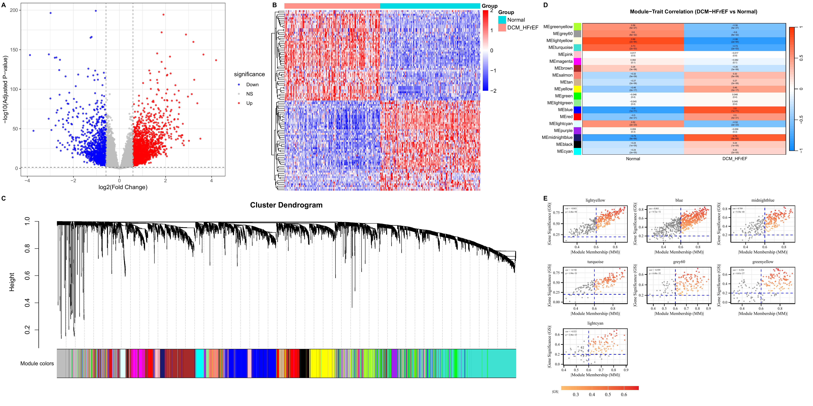
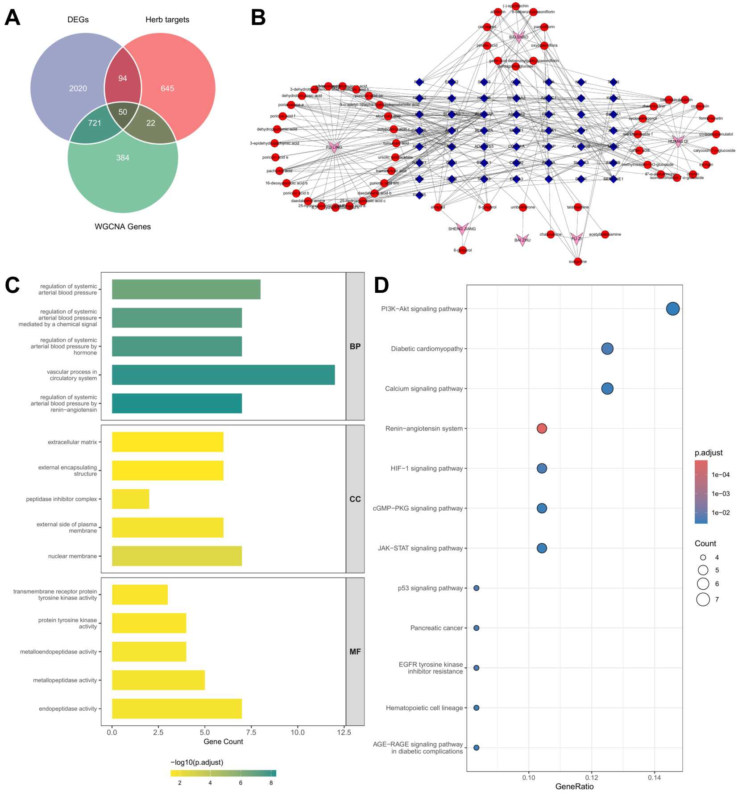
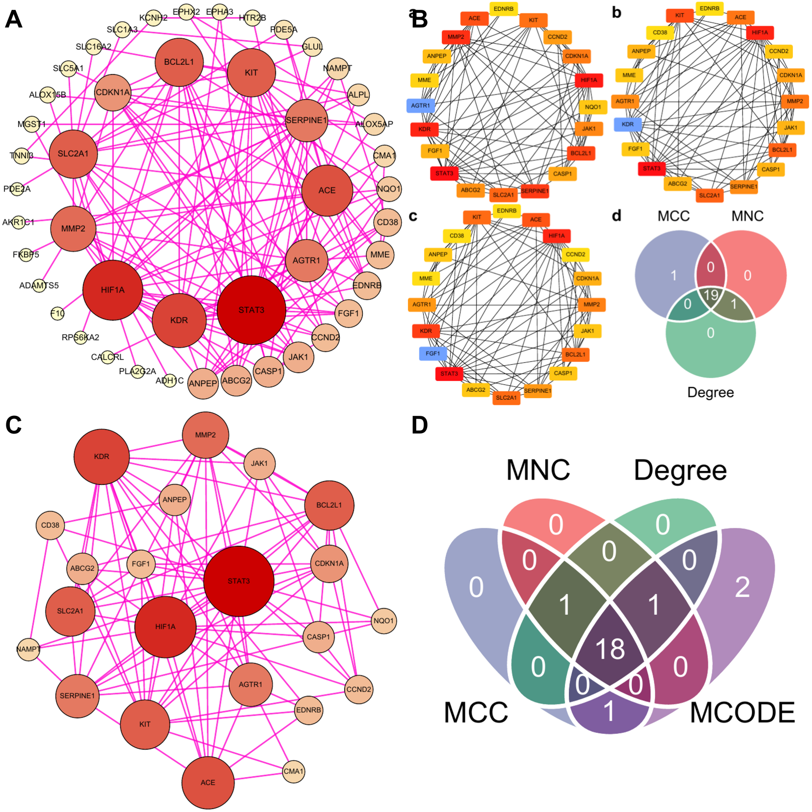
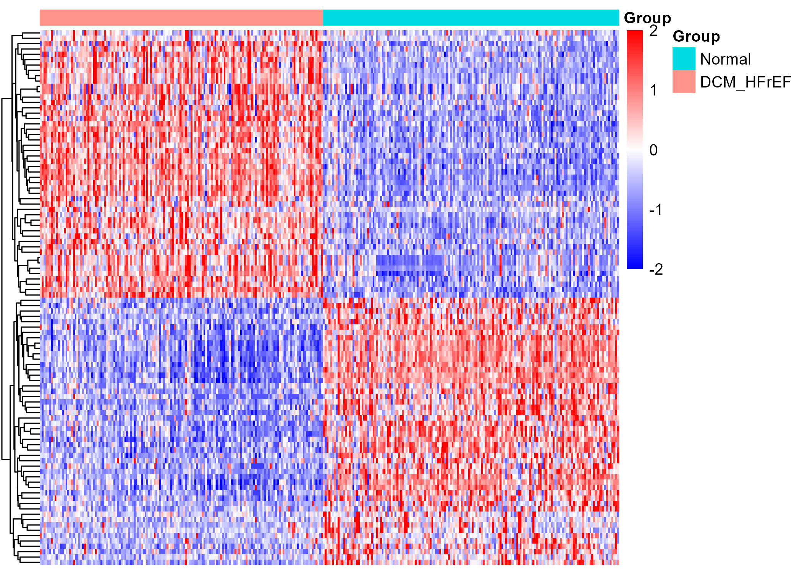

# Introduction

---

Chronic heart failure (CHF) is an important terminal manifestation of cardiovascular diseases worldwide, characterized by high incidence, high hospitalization rate, and high mortality [@valente2026HF]. A recently systematic review and Meta-analysis showed that the global pooled incidence of heart failure is 2.72 per 1000 person-years, with the number of incident cases projected to keep increasing alongside the progression of population aging and urbanization [@ballena2026HF]. According to left ventricular ejection fraction (LVEF), heart failure can be classified into three subtypes, namely heart failure with reduced ejection fraction (HFrEF, LVEF ≤ 40%), heart failure with mildly reduced ejection fraction (HFmrEF, LVEF 41%~49%), and heart failure with preserved ejection fraction (HFpEF, LVEF ≥ 50%) [@bozkurt2021HF]. Among them, HFrEF accounts for 48%~66% of all heart failure patients [@valente2026HF] and approximately 34.87% of hospitalized heart failure patients in China [@li2026ChinaHF], with its core pathological feature being severe impairment of left ventricular systolic function and a worse prognosis than other subtypes. Currently, medical treatment for HFrEF is centered on guideline‑directed medical therapy (GDMT), which consists of four pillar drugs, namely angiotensin receptor‑neprilysin inhibitors, β‑blockers, mineralocorticoid receptor antagonists, and sodium‑glucose cotransporter 2 inhibitors [@shahverdi2026HFrEF]. These drugs can significantly prolong survival in HFrEF patients. Nevertheless, in real-world clinical practice, problems such as delayed drug initiation, improper sequencing, and low target dose achievement are common and residual risk remains high even with optimal quadruple therapy [@shahverdi2026HFrEF; @jurin2026HFrEF].

Traditional Chinese medicine (TCM) has accumulated extensive experience in the adjuvant treatment of CHF [@lan2024TCM]. As a classic TCM formula for warming yang and promoting diuresis, Zhenwu Decoction has demonstrated definite clinical efficacy in the management of HFrEF. Multiple meta-analyses have confirmed that Zhenwu decoction combined with conventional Western medical treatment can significantly improves clinical response rates and enhances cardiac function parameters, with acceptable safety profiles [@mo2017ZWD; @han2022ZWD]. Notably, elderly HFrEF patients are particularly prone to concurrent qi deficiency syndrome. A cross-sectional study of 1,676 hospitalized CHF patients reported that qi deficiency and blood stasis syndrome accounts for 26.19% of cases, ranking second only to phlegm‑turbidity and blood stasis syndrome [@du2024HF]. Clinically, such patients typically present with classic qi deficiency symptoms, including fatigue, spontaneous sweating, shortness of breath and recurrent colds. Therefore, therapeutic strategies that merely warm yang and induce diuresis without concomitant qi supplementation often result in suboptimal outcomes. *Astragalus membranaceus*, a key qi‑tonifying herb, exerts cardiovascular protective effects including improved cardiac function, anti‑inflammation, and anti‑fibrosis [@lu2011HQ; @yang2012HQ]. Added to Zhenwu Decoction, it forms Zhenwu Huangqi Decoction (ZWHQD, @tbl-1) to tonify qi, consolidate the exterior, induce diuresis, and reduce edema. In ZWHQD, the sovereign herb *Aconiti Lateralis Radix Praeparata* (Fu Zi) warms the kidney, assists yang, and promotes diuresis by activating qi transformation. The minister herb *Astragalus Membranaceus* (Huang Qi) tonifies qi, consolidates the exterior, and alleviates edema, thus synergizing with *Aconiti Lateralis Radix Praeparata* to strengthen both yang-warming and qi-tonifying effects. The other minister herbs, *Poria* (Fu Ling) and *Atractylodis Macrocephalae Rhizoma* (Bai Zhu) invigorate the spleen and resolve dampness. The assistant herb *Paeonia Lactiflora* (Bai Shao) nourishes yin and astringes to counteract the dry-hot nature of the sovereign herb. Another assistant herb, *Zingiberis Rhizoma Recens* (Sheng Jiang),warms the middle energizer to augment the yang-warming action. Clinical evidence indicates that ZWHQD can significantly improve cardiac function, relieve symptoms of fatigue and edema, and enhance patients’ quality of life [@zhou2023ZWHQD]. Notwithstanding its well-established clinical efficacy, the material basis and exact pharmacological mechanisms of ZWHQD in treating HFrEF remain poorly elucidated.

Identification of the blood-absorbed active components of Zhenwu Huangqi Decoction (ZWHQD) and their potential therapeutic targets represents a fundamental step toward elucidating its molecular mechanisms in HFrEF. Mainstream databases for traditional Chinese medicine (TCM) (e.g., TCMID [@xue2013TCMID], TCMSP [@ru2014TCMSP], ETCM [@xu2019ETCM], HERB [@fang2021HERB]) mainly document the intrinsic chemical components of herbs, yet neglect the actual forms of these agents that enter the systemic circulation following in vivo metabolism. As an orally administered TCM formula, only the blood-migrating components of ZWHQD and their corresponding metabolites can directly interact with biological targets to exert pharmacological actions. Therefore, target prediction based on the "prescription–blood-absorbed components–targets" network pharmacology strategy is more physiologically and pharmacodynamically rational than relying solely on the intrinsic chemical components of TCM herbs. The Database of Constituents Absorbed into the Blood and Metabolites of Traditional Chinese Medicine (DCABM-TCM) [@liu2023DCABM] is the first professional database dedicated to systematically collecting the blood-absorbed components of TCM formulas and single herbs. Through manual literature mining, DCABM-TCM has compiled 1,816 blood-absorbed components (including prototype components and their metabolites) that have been experimentally validated, covering 192 TCM formulas and 194 kinds of TCM herbs.

Network pharmacology constructs a "drug-ingredient-target-disease" multi-level regulatory network, which systematically reveals the holistic synergistic therapeutic mechanism of traditional Chinese medicine (TCM) compounds in treating heart failure through multi-components, multi-targets, and multi-pathways [@zhai2025NetPharm; @huang2024ZWD; @yan2023ZWD]. Differential gene expression analysis and weighted gene co-expression network analysis (WGCNA) based on bulk transcriptomics identify hub differentially expressed genes and co-expression modules associated with heart failure, thereby uncovering key molecular pathways and regulatory hubs [@li2025DEG]. Single-cell RNA sequencing (scRNA-seq) resolves the cellular heterogeneity of myocardial tissue in heart failure at single-cell resolution, identifies disease-specific cell subsets, reconstructs cell–cell ligand-receptor interaction networks, and provides a refined perspective for understanding the microenvironment remodeling of heart failure and the cellular targets of TCM intervention [@rao2021scRNA; @zhang2024scRNA; @gardner2026scRNA]. Immune infiltration analysis employs deconvolution algorithms to accurately assess changes in the abundance of various immune cells in the myocardial immune microenvironment, further clarifying the regulatory effect of TCM on the inflammatory microenvironment of heart failure [@zhu2025Immune]. Machine learning constructs high-precision diagnostic models based on omics data, enabling the efficient identification of core biomarkers related to heart failure [@saqib2024ML; @hamid2025ML]. Mendelian randomization uses genetic variants as instrumental variables to infer causal associations between immune phenotypes, circulating proteins, and heart failure, effectively eliminating confounding bias and enhancing the reliability of research conclusions [@rasooly2025MR]. Molecular docking technology virtually verifies the binding mode and affinity between active ingredients and target proteins, providing theoretical guidance for subsequent target validation [@yan2023ZWD; @xing2025Docking]. The integrated application of these research methods facilitates the clarification of the material basis and molecular mechanism of TCM formulas such as ZWHQD in the treatment of HFrEF, while offering multi-dimensional scientific evidence. 

In the present study, we aimed to elucidate the therapeutic mechanism of ZWHQD in the treatment of HFrEF by integrating network pharmacology, bioinformatics, and molecular docking. We first identified the blood-absorbed active molecules of ZWHQD using the DCABM‑TCM database and retrieved their potential therapeutic targets from multiple target prediction databases. Subsequently, we identified HFrEF-related genes via differential gene expression (DEG) analysis and weighted gene co‑expression network analysis (WGCNA), and confirmed the core therapeutic targets by intersecting these disease-related genes with ZWHQD’s predicted targets. Next, we identified hub genes through protein‑protein interaction (PPI) network analysis combined with a hierarchical screening strategy based on the "Jun-Chen-Zuo-Shi" (ie. “sovereign‑minister‑assistant‑courier” ) theory of traditional Chinese medicine formulation. We then explored HFrEF-related key pathways through enrichment analysis, and assessed the abundance and distribution of hub genes across different immune cell types in the myocardial immune microenvironment via immune infiltration analysis. We further identified ZWHQD‑modulated cell subsets by scRNA‑seq, identified diagnostic biomarkers via machine learning, determined causal genes using Mendelian randomization, and validated the binding affinity of ZWHQD’s active molecules to core therapeutic targets through molecular docking. Finally, we systematically clarified ZWHQD’s regulatory mechanism and material basis by constructing a regulatory network. Collectively, we believe that this study will provide theoretical guidance for the clinical translation and mechanistic investigation of ZWHQD in the treatment of HFrEF.

---

# Materials and Methods

---


## Collection of active ingredients of ZWHQD

The [DCABM-TCM](http://bionet.ncpsb.org.cn/dcabm-tcm/) [@liu2023DCABM] database was used as the primary source to systematically retrieve blood‑absorbed compounds from each medicinal herb in ZWHQD, along with their chemical structural information. These candidate components were screened according to established criteria, and standardized chemical data were obtained from the [PubChem](https://pubchem.ncbi.nlm.nih.gov/) [@kim2025pubchem] database.

Specifically, we identified and collected blood-absorbed compounds from six medicinal herbs of ZWHQD (see @tbl-1) by performing Chinese Pinyin-based herb queries in the [DCABM-TCM](http://bionet.ncpsb.org.cn/dcabm-tcm/) [@liu2023DCABM] database. To refine the candidate list, we applied multiple filters: (i) compounds without a valid PubChem Compound Identifier (CID) were discarded; (ii) highly toxic diester diterpenoid alkaloids (e.g., aconitine) derived from *Aconiti Radix Lateralis Preparata* (Fu Zi) were excluded, because during the standard decoction process of ZWHQD, these compounds undergo substantial hydrolysis, converting into less toxic monoester alkaloids (e.g., benzoylaconine) and further into non‑toxic amine alcohol alkaloids (e.g., aconine), resulting in negligible or undetectable levels in the final decoction [@gao2022Aconitine; @huang2007Aconitine]; (iii) ubiquitous endogenous substances, including common saccharides, amino acids, organic acids and their metabolites, as well as other nutritional components, were excluded because they lack target‑specific pharmacological functions and contribute minimally to the therapeutic properties of ZWHQD.

Given the notable pharmacological bioactivity of compounds from *Astragalus Membranaceus*, we manually supplemented cycloastragenol, an in vivo bioactive metabolite of astragaloside IV with well-ocumented effects [@zhao2025cycloastragenol], into the active compound dataset. After completing systematic filtration and manual supplementation, we defined the remaining compounds as the final candidate active ingredients of ZWHQD.

Finally, to characterize the molecular properties of these candidate active ingredients, we queried each qualified compound in [PubChem](https://pubchem.ncbi.nlm.nih.gov/) [@kim2025pubchem].  For each compound, we extracted core chemical data, including IUPAC names, molecular formulas, molecular weights and SMILES strings. Additionally, we downloaded the corresponding SDF files. The SMILES strings (or SDF files) were used for target prediction, and the SDF files also provided the essential 3D conformers for subsequent molecular docking.

## Identification of ZWHQD candidate target genes

we predicted potential targets of the blood-absorbed compounds using seven authoritative online platforms, including [BATMAN-TCM 2.0](http://bionet.ncpsb.org.cn/batman-tcm/) [@kong2023batman], [SuperPred 3.0](https://prediction.charite.de/) [@gallo2022superpred], [SwissTargetPrediction](https://www.swisstargetprediction.ch/) [@daina2019swiss], [PharmMapper](https://www.lilab-ecust.cn/pharmmapper/) [@liu2010pharm,@Wang2017pharm],  [TargetNet](http://targetnet.scbdd.com/) [@yao2016targetnet], [PPB3](https://ppb3.gdb.tools/) [@Darsaraee2026ppb3], and [SEA](https://sea.bkslab.org/) [@keiser2007sea]. 

Subsequently, we retained high‑confidence target candidates using the following thresholds: score ≥0.84 for BATMAN‑TCM 2.0; probability ≥70% and accuracy ≥90% for SuperPred; probability ≥0.1 for SwissTargetPrediction; z‑score >0 and Norm Fit >0.9 for PharmMapper; probability ≥0.5 for TargetNet; single human protein for PPB3; and P Value < 1e<sup>-10</sup>, Z.Score > 5 and  Max.Tc >0.5 for SEA. All predicted targets restricted to human origin only.

To ensure analytical uniformity and interoperability, we then mapped and standardized all retained candidates to official human gene symbols using the [UniProt knowledgebase](https://www.uniprot.org/). We confirmed non‑standard names or aliases, excluded targets that could not be standardized, and removed redundant entries.

Finally, we refined the target list through multi‑tool voting combined with literature evidence. We preferentially retained targets appearing in at least two tools, and we also considered single‑tool high‑confidence targets when supported by published literature.

## Identification of HFrEF-associated genes

We integrated multiple transcriptome datasets from the GEO database and systematically carried out the screening and validation of target genes related to heart failure with reduced ejection fraction (HFrEF). [GSE141910](https://www.ncbi.nlm.nih.gov/geo/query/acc.cgi?acc=GSE141910) was selected as data sources for the bulk RNA-seq expression spectrum of HFrEF in this study, and [GSE116250](https://www.ncbi.nlm.nih.gov/geo/query/acc.cgi?acc=GSE116250), [GSE161472](https://www.ncbi.nlm.nih.gov/geo/query/acc.cgi?acc=GSE161472), [GSE135055](https://www.ncbi.nlm.nih.gov/geo/query/acc.cgi?acc=GSE135055), [GSE120895](https://www.ncbi.nlm.nih.gov/geo/query/acc.cgi?acc=GSE120895), and [GSE19303](https://www.ncbi.nlm.nih.gov/geo/query/acc.cgi?acc=GSE19303) were selected as a validation set to perform the diagnostic value assessment with the sample heart tissues. [GSE183852](https://www.ncbi.nlm.nih.gov/geo/query/acc.cgi?acc=GSE183852) was selected for subsequent 10X single-cell RNA sequencing (scRNA-seq) analysis.

We annotated probes to gene symbols using the org.Hs.eg.db database and retained the maximum expression value for genes with multiple matching probes. We then used the **[sva]**() package to remove batch effects across series and groups in GSE141910 [@zhang2020SVA].

We performed differential expression analysis between the HFrEF and healthy control (Normal) groups using the **[DESeq2]**(https://github.com/thelovelab/DESeq2) [@love2014DESeq2] package. We calculated the fold change (FC) as the ratio of mean expression in disease samples to that in normal samples, and set the thresholds for differentially expressed genes (DEGs) at p < 0.05 and an absolute log2FC ≥ 0.585. 

We also used weighted gene co-expression network analysis (WGCNA) [@zhang2005WGCNA] to identify gene sets highly correlated with disease traits. We removed outliers, filtered out low‑expression genes, and constructed a scale‑free co‑expression network before merging modules with similar expression profiles. After removing batch effects, we calculated gene significance (GS) as the correlation between module eigengenes and disease traits, and module membership (MM) as the correlation between gene expression and module eigengenes. We then selected candidate disease genes by intersecting the WGCNA results (MM ≥ 0.6, GS ≥ 0.2) with the differentially expressed genes.

## Identification of ZWHQD-HFrEF hub gene set

The network integration and analysis tool CytoScape 3.10.3 was employed to construct the "Herb-Ingredient-Target" interaction network, with the constituent serving as the connecting node. The "Target" nodes depicted in this network are regarded as the target of action, with their symbol IDs matching those of the candidate target genes for the constituents of ZWHQD. 

Potential HFrEF genes were obtained via a process of data integration involving WGCNA and DEG analysis. The matched proteins of potential HFrEF genes were imported into the [STRING](https://string-db.org/) database for subsequent analyses, along with candidate ZWHQD target proteins corresponding to the "Target" nodes in the “Herb-Ingredient-Target” network. The biological species was selected as "*Homo sapiens*", and the inclusion criteria were set to ensure that targets meeting the minimum interaction threshold of "medium confidence (0.400)" would be included in the protein-protein interaction (PPI) network analysis. The inter-node degree was calculated using the CytoNCA plug-in with CytoScape 3.10.3 software. Subsequently, we identified significant sub-networks (degree cutoff = 2, node score cutoff = 0.2, k-core = 2, max.depth = 100) among the potential target proteins using the Molecular Complex Detection (MCODE) plug-in. Additionally, the top-ranked target genes computed by the Cytohubba plugin, which were screened using four local-based methods and six global-based methods, and genes that overlapped with the results of DEGs (|log2 FC| > 0.585) and WGCNA, would be incorporated into the collection of hub genes screened by the MCODE key sub-networks as a complement. Then, ZWHQD-HFrEF hub genes characterized by Chinse materia medica were acquired for subsequent identification.

## GO and KEGG enrichment analysis of the ZWHQD-HFrEF hub genes

After obtaining the ZWHQD-HFrEF hub genes, which is characterized by both ZWHQD and disease, we performed enrichment analysis to better elucidate its biological significance. To ensure the uniqueness of the target genes, the Symbol IDs of the genes were converted to ENTREZIDs based on the *[org.Hs.eg.db]*(https://gith ub.com/ruby-on-bioc/org.Hs.eg.db) package, and the *[clusterProfiler]*(https://github.com/YuLab-SMU/clusterProfiler) package was used for gene ontology (GO) enrichment and Kyoto encyclopedia of genes and genomes (KEGG) signaling pathway enrichment of the ZWHQD-HFrEF hub set. The final visual presentation then includes entries for which the results are significant (*p* < 0.001) and have the leading enrichment scores for cell component (CC), biological process (BP), molecular function (MF), and metabolic pathway. The differential expression of ZWHQD-HFrEF hub genes between the HFrEF and HC groups was also demonstrated.  

## Immune infiltration analysis using the CIBERSORT algorithm

To investigate the composition of the immune micro-environment in HFrEF peripheral blood tissue samples and to further analyze the classes of immune cells that play an important role in RA. This algorithm is based on linear support vector regression and was used for deconvolution analysis. Using LM22 as the reference dataset for gene expression labeling of immune cell types, the deconvo\_tme() function in the [CIBERSORT](https://github.com/Moonerss/CIBERSORT) package was applied to estimate the abundance and relative proportions of immune cell subpopulations in each sample. The distribution of these relative cell subpopulations within the HFrEF group, between the HFrEF and HC groups, and the Spearman’s rank correlation with the ZWHQD-HFrEF genes were also examined. 

## Estimation of AUCell Scores for Target Cell Subsets

In order to convert the post-read HFrEF patient samples to Seurat objects, the *CreateSeuratObject()* function of the Seurat package (https://github.com/satijalab/seurat) was employed. The *PercentageFeatureSet()* function was utilized to assess the quantity of erythrocyte and mitochondrial RNA per cell in the sample. Following the implementation of quality control and data filtering, the data underwent normalization using the *NormalizeData()* function with the LogNormalize method. Subsequently, the *FindVariableFeatures()* function of the Seurat package was employed to identify highly variable genes (HVGs) within the peripheral blood mononuclear cell sample, with the objective of facilitating subsequent analyses in the identification of bio-signals. To reduce the variability among the sample genes for subsequent feature dimensionality reduction, the data was normalized using the *ScaleData()* function. The top 2,000 genes exhibiting the highest variability were selected for principal component analysis (PCA). Cell subclusters were obtained through unsupervised clustering of cells using the *FindNeighbor()* and *FindClusters()* functions (reduction = 1.5), which were then downscaled to two dimensions using Uniform Manifold Approximation and Projection (UMAP) techniques. To enhance the precision of cell subpopulation annotation, we undertook an initial review of the automatic annotation results generated by the *singleR* package. Subsequently, the cell subpopulations were manually annotated by referencing the marker genes for various cell types in peripheral blood tissues available in the [CellMarker](http://xteam.xbio.top/CellMarker/) database. The results of the cell subpopulation annotation, obtained through a combination of automatic and manual annotation, were visualized using the *DimPlot()* function.  

The AUCell package was utilized to identify enriched pathways and gene expression of the ZWHQD-HFrEF core gene set in cells for scRNA-seq. The *AUCell\_buildRankings()* function and the *AUCell\_calcAUC()* function were used to compute the gene expression rankings and the AUCs enriched in cells, respectively, which were then mapped to the UMAP and t-SNE visualizations of the cell subpopulations and visualized the density distribution by heatmap. 

##  Identification of causally associated ZWHQD-HFrEF core genes via Mendelian Randomization

MR analysis was conducted to investigate the potential causal relationship between the ZWHQD-HFrEF genes and RA. As “exposure” factors for HFrEF “outcome”, we batch matched the expression quantitative trait loci (eQTL) that regulate the appropriate ZWHQD-HFrEF hub gene. The TwoSampleMR package (https://github.com/MRCIEU/TwoSampleMR) was utilized for the purpose of performing MR analysis. Single nucleotide polymorphisms (SNPs) that were significantly associated with eQTLs regulating ZWHQD-HFrEF hub genes were extracted as instrumental variables (IVs) at the traditional genome-wide level (correlation hypothesis, threshold chosen as p < 5 × 10^-8). Meanwhile, IVs in strong linkage disequilibrium were excluded (independence hypothesis, r2 < 0.001, kb = 10,000). The IEU open genome-wide association study (GWAS) project (https://gwas.mrcieu.ac.uk/) was then queried, and the GWAS dataset with ID ebi-a-GCST90018910 was selected as the source of HFrEF “outcome”. The harmonise\_data() function was used to align the effect alleles and effect sizes between the eQTL “exposure” data of ZWHQD genes and the “outcome” GWAS data of HFrEF for MR analysis. To ensure that the SNPs can be used as proxies for “exposure” to reflect their association with “outcome”, and to avoid the effects of weak instrument bias, the F statistic was used to circumvent the strength of the genetic variant IVs. The explanatory effect of each IV on the “exposure” variance is also independent, as each selected IV is independent of the others. Therefore, the phenotypic variance explained (PVE) is calculated as the sum of the proportions of the exposure variance explained by each IV.  

For the primary MR analysis, the inverse variance weighted (IVW) method was selected if the number of SNPs in the “exposure” gene eQTL that could be used as valid IVs was greater than or equal to two. In the absence of a clear preference, the results were analyzed using the Wald ratio method. (p < 0.05). The odds ratio (OR) is a statistically analyzed effect size whose value is greater than or <1. This indicates that “exposure” to the eQTL regulating the hub gene acts as a risk or protective factor and has a causal effect on the “outcome” of RA. In addition, MR-Egger, Weighted Median, MR pleiotropy residual sum and outlier (MR-PERSSO), and Leave-One-Out analysis. These were employed to complement the primary analysis and to further identify possible horizontal pleiotropy in the analytical process, as well as to assess the robustness of the results.  

The Bayesian co-localization analysis, conducted with the Coloc package (https://github.com/chr1swallace/coloc), provides further reinforcement and clarification of causal associations through the exploitation of vertical pleiotropy, whereby the gene eQTL acts as the "exposure". On this basis, the Steiger directionality test and reverse MR analysis would be employed to further investigate the directionality of causal associations to circumvent endogeneity bias, particularly bidirectional causality, and so forth (exclusivity hypothesis).  

## Assessment of the Diagnostic Value of ZWHQD-HFrEF Core Genes

To investigate the diagnostic value of ZWHQD-HFrEF core genes that are causally associated with RA, we would utilize them as variables for HFrEF diagnostic prediction analysis. Logistic regression models were constructed using the lrm() function in the rms package. Genes with a significant association (p < 0.1) in the univariate logistic regression were included in the multivariate logistic regression. Nomograms were then generated using the nomogram() function.  

To evaluate the model fit (discrimination) and predicted probability (calibration), we utilized the roc() function and the calibrate() function from the pROC package to create a ROC curve and a corrected calibration curve. Additionally, we performed decision curve analysis (DCA) using the decision\_curve() function in the rmda package to ascertain the extent of risk or benefit associated with clinical decisions that impact patients. 

## Single gene set enrichment analysis of interested gene

The expression of the interested gene in the set of ZWHQD-HFrEF core genes served as the basis for grouping. The bulk RNA samples were then categorized into high-expression and low-expression groups. Differences between groups (p < 0.05, |log2 FC| > 1) were analyzed using the limma package. The groups were then ordered according to the log2 FC, which indicates the correlation between the sample genes and the phenotypes of the interested genes. A GSEA should be conducted on the genes of interest that are associated with the differentially expressed genes, utilizing the clusterProfiler package.  

## Molecular docking of Key ZWHQD constituents with interested gene

We obtained the SDF file of the 3D Conformer of the candidate constituents of ZWHQD from the PubChem compound database (https://pubchem.ncbi.nlm.nih.gov/) and the 3D structure of the interested targets from the Protein Data Bank (PDB, http://www.rcsb.org/). The Maestro 13.5 interface of Schr ̈odinger software was applied to perform the requisite pre-processing. This included the removal of water molecules, the addition of polar hydrogen atoms, and the generation of grid binding pockets (SiteScore > 1, DScore > 1, balance > 0.3, volume > 225). Molecular docking was performed between the receptor of the interested target gene and the ligand of the candidate constituent. The grid module was then applied to obtain the docking score. Subsequently, the docked structure files were exported and visualized using PyMol 2.6 software.

---

# Results

---

## Active ingredients and target genes of ZWHQD

We identified a total of 101 active ingredients of ZWHQD from the DCABM-TCM Database, with cycloastragenol manually supplemented. Detailed information on these compounds is provided in the. These active ingredients primarily cover flavonoids, terpenoids, phenolic acids, tannins, alkaloids, glycosides, as well as gingerol and shogaol derivatives. We further collected putative target proteins of these active ingredients from seven online databases. All retrieved target entries were standardized to official gene Symbol IDs according to the UniProt database. Ultimately, a total of 811 candidate genes corresponding to 98 effective compounds were obtained for the subsequent mechanistic exploration of ZWHQD, as summarized in the Final_All worksheet of.


## Potential HFrEF-associated genes

A gene expression profile dataset with 20,810 genes was obtained by annotating the GSE141910 subsets and removing the batch effect ([Supplementary Figure S1]()). 

Differential expression analysis was performed on 20,810 genes using DESeq2. Genes with |log2FC| > 0.585 (i.e., absolute fold change > 1.5) and adjusted P value (padj) < 0.05 were considered significantly differentially expressed. Differential expression analysis of 21,572 genes was conducted via DESeq2. Genes satisfying the thresholds of |\log_2\text{FoldChange}| > \log_2(1.5) and adjusted P value (padj) < 0.05 were defined as significant differentially expressed genes (DEGs). In total, 3,188 DEGs were screened, consisting of 1,986 upregulated and 1,202 downregulated genes.
The number of upregulated genes was obviously predominant, reflecting robust activation of inflammatory response, immune function and cellular stress injury-related pathways in HFrEF myocardium. By contrast, fewer genes exhibited decreased expression, among which protective functional genes, metabolic regulators and tissue structural genes were largely suppressed.
Highly expressed upregulated genes contained COL22A1 (\log_2\text{FC}=4.23), SEZ6L (3.69), TNMD (3.38), SFRP4 (3.22), PENK (3.20), FHAD1-AS1 (3.16), HBD (3.07), LYPD1 (3.03), LAMP5 (3.03) and CAPN6 (2.96), which predominantly participate in extracellular matrix remodeling, neuropeptide signaling and cellular stress response. In contrast, downregulated genes were mainly implicated in inflammatory modulation, substance metabolism, ion transport and epithelial differentiation. Representative downregulated genes included IL1RL1 (\log_2\text{FC}=-3.88), SERPINA3 (-3.23), RNASE2 (-3.07), PI15 (-3.04), LOC105378356 (-3.01), FAM83B (-3.01), OVOS2P (-3.00), LCN6 (-2.99), TUBA3E (-2.87) and LBP (-2.85).  The volcano plot and heatmap of all DEGs are shown in @fig-1 A and B, respectively. 

We also examined associations between disease traits and transcriptomic gene expression patterns using WGCNA. 
**Twenty-one** gene modules were identified in the analysis on the basis of hierarchical clustering dendrograms, and correlations between the modules and their association with disease traits were calculated using the Spearman’s rank correlation test and Mantel test (**Fig. 2E**). WGCNA identified **675** hub genes from MEbrown (r = **0.84**, p = **8e-04**) and MEroyalblue (r = -0.70, p = 8e-07) that were significantly correlated with disease traits (**Fig. 1C, D**). The potential HFrEF genes for the study were formed by combining the DEGs (|log2 FC| > 0.585) with the WGCNA hub genes.

 


## Functional enrichment of ZWHQD-HFrEF hub genes

and used to construct the “Herb-Ingredient-Target” visualization network (Fig3A). A total of *787* nodes and *10401* edges were included in the PPI network of potential ZWHQD targets and candidate ZWHQD targets. *Six* subnetworks were co-clustering based on MCODE algorithm. 
We considered the targets in the two subnetworks with the highest MCODE score as MCODE hub targets (Fig.3B). 
The top-ranked targets obtained by the local-based and global-based methods of the Cytohubba algorithm served as a complement to the results (Fig.3C), 
and were compiled into a collection of 117 ZWHQD-HFrEF hub genes (including 68 HFrEF hub genes, 61 ZWHQD genes, and 18 intersected genes) for subsequent studies (Fig.3D).

The number of *177* hub genes characterized with both ZWHQD and HFrEF was analyzed based on GO enrichment and KEGG signaling pathway enrichment, which indicates that ZWHQD on GO–CCs focuses on membrane microdomain, membrane raft, cell substrate junction, focal adhesion, and endoplasmic reticulum lumen. It was also involved in sets of GO-BPs, mainly including response to oxidative stress, response to molecule of bacterial origin, response to lipopolysaccharide, epithelial cell proliferation, and response to radiation. Furthermore, ZWHQD was mainly related to DNA binding transcription factor binding, cytokine receptor binding, receptor ligand activity, and RNA polymerase II specific DNA binding transcription factor binding, cytokine activity and some other GO-MFs (Fig.3E; Supplementary Fig. S2A, B). 
The KEGG signaling pathway analysis demonstrates that the phosphoinositide 3 kinase (PI3K)‐serine/ threonine kinase (AKT) signaling pathway (p = 1.66E-29, Gene Count = 42) is most highly correlated with the ZWHQD-HFrEF hub genes. Some pathways that are reported to be strongly associated with inflammatory response, autoimmune response, and even RA, such as the mitogenactivated protein kinase (MAPK) signaling pathway, the tumor necrosis factor (TNF) signaling pathway and the interleukin-17 (IL-17) signaling pathway are also enriched in the top rank (Fig.3F, Supplementary Fig. S2C, D).


## Immune Infiltration Profiling

Immune infiltration analysis was used to estimate the abundance of immune cells in the gene expression profile dataset (Fig. 4A). Group box plots show the differences in the estimation of cell proportions between the RA/HC sample groups (Fig. 4C), where the cell types with significant  differences were, in descending order, dendritic cells activated (p <  0.05), T cells cluster of differentiation (CD) 8+ (p < 0.05), T cells CD4+ memory resting (p < 0.01), mast cells resting (p < 0.01), macrophages M1 (p < 0.01). Sequential box plot showed the estimation of cell proportions in HFrEF samples (Fig. 4C), natural killer (NK) cells resting, T cells  CD8+, macrophages M0, T cells CD4+ memory resting, and monocytes are considered as the five cell categories with the highest cell proportions in HFrEF samples. Spearman’s rank correlation coefficients were used to characterize the correlation between the expression profiles of the HFrEF hub genes and the abundance of immune cell infiltration, which  are shown in a correlation heat map (Fig. 4B). monocytes, T cells CD8+, dendritic cells activated presented a strong correlation with ZWHQDRA hub genes.


## Cell subpopulation annotation and AUCell scoring in scRNA-seq

The scRNA-seq dataset (GSE159117) from the GEO database was filtered and quality controlled to generate normalized Seurat object data containing 2406 genes. The expression characteristics of this HFrEF sample are shown in the violin plot and scatterplot (Supplementary Fig. S3A). We identified the top 2000 HVGs for subsequent PCA (Supplementary Fig. 3C). MZB1 and IGJ are the top two HVGs, all of which have been reported to play a role in IgM assembly and/or biosynthesis. The scaled data can be further processed through a linear downscaling PCA to reduce the scale of the data (Supplementary Fig. 3B). JackStraw plot and ElbowPlot then determine the first 15 dimensions as the number of valid PCs in the dataset (Supplementary Fig. 3D). Based on this, the k-nearest neighbor classification algorithm was constructed based on Euclidean distances in PCA space, edges were drawn between cells with similar feature expression patterns, and downstream clustering resolution was set to 1.5 (Supplementary Fig. 3E). The UMAP and t-SNE techniques revealed 15 cell subclusters after nonlinear dimensionality reduction clustering (Supplementary Fig. 3F, G), which were finally annotated into five cell subpopulations of B cells, T cells, NK cells, classical monocytes, and non-classical monocytes (Fig. 5A, B).

In the subpopulation of scRNA-seq cells, we calculated AUCell scores for the custom ZWHQD-HFrEF hub gene set and its PI3K-AKT signaling pathway with the highest enrichment in enrichment analysis. Highly active cells in the interested gene set would exhibit higher AUCell scores, and the result described that monocytes present a significant degree of activity in these two gene sets (Fig. 5C, D).

## Causal Core Genes Associated with ZWHQD-HFrEF

We identified eQTL regulating ZWHQD-HFrEF hub genes that were batch-matched as exposure factors for HFrEF outcome, and 289 SNPs that satisfied the correlation hypothesis and the independence assumption hypothesis were considered as IVs for MR analysis. A total of seven ZWHQD-HFrEF core genes, including CASP8, PPARG, IKBKB, PPARA, IFNG, MYC, and STAT3 (), were identified as being causally associated with RA. Among these, CASP8 [IVW, OR = 0.8425, 95 %CI(0.6993, 1.0151), p = 0.0014], PPARG [IVW, OR = 0.8901, 95 % CI(0.8292, 0.9555), p = 0.0013], STAT3 [IVW, OR = 0.8940, 95 %CI (0.8053, 0.9925), p = 0.0356) were the protective factors on RA, while IKBKB (IVW, OR = 1.1310, 95 %CI(1.0032, 1.2751), p = 0.0443), IFNG [IVW, OR = 1.1918, 95 %CI(1.0059, 1.4119), p = 0.0451), MYC [IVW, OR = 1.2673, 95 %CI(1.0482, 1.5322), p = 0.0145], PPARA [WR, OR =  1.2781, 95 %CI(1.0022, 1.6299), p = 0.0480] show the negative correlation with HFrEF (Fig. 6B). The FDR correction, as implemented through the Benjamini-Hochberg method, is designed to exclude false positives for CASP8 (adjusted p = 0.0255) and PPARG. (adjusted p = 0.0373). No heterogeneity or horizontal pleiotropy were significant for the seven genes in the primary analysis.  Bayesian co-localization analysis fairly suggested that CASP8 (coloc. abf-PP.H3 = 0.137, coloc.abf-PP.H4 = 0.484) shared the same variant with RA, quite indicating that PPARG (coloc.abf-PP.H3 = 0.557, coloc. abf-PP.H4 = 0.201), STAT3 (coloc.abf-PP.H3 = 0.537, coloc.abf-PP.H4 = 0.107), IKBKB (coloc.abf-PP.H3 = 0.474, coloc.abf-PP.H4 = 0.0326), MYC (coloc.abf-PP.H3 = 0.693, coloc.abf-PP.H4 = 0.0063), and HFrEF associated different variants in a particular the genomic region. PPARA (coloc.abf-PP.H2 = 0.670, coloc.abf-PP.H3 = 0.0775) and IFNG (coloc.abf-PP.H2 = 0.682, coloc.abf-PP.H3 = 0.194) did not share genetic linkage in genomic region (). Bidirectional MR analysis was performed to show that HFrEF did not have a causal effect on the levels of the seven identified target genes (Supplementary Fig. S4), and Steiger filtering further ensured the directionality of causal associations ().


Identification of ZWHQD-HFrEF core genes with causal association by MR analysis. A: The volcano diagram of MR results for ZWHQD-HFrEF hub genes and the risk of RA. B: The forest plot of MR results for ZWHQD-HFrEF core genes that causally associated with RA.


## Diagnostic Value of Core Genes in HFrEF

We obtained the bulk RNA dataset (GSE17755) containing CASP8, PPARG, IKBKB, PPARA, IFNG, MYC, and STAT3 in the expression profiles and created a training set (n = 126) and a validation set (n = 31) at a ratio of 7:3 to explore the diagnostic value of ZWHQD-HFrEF core genes. The nomogram shows the results of visualizing the multivariate logistic regression model constructed using the ZWHQD-HFrEF core genes as predictors of HFrEF (Fig. 7A). The ROC curve was created to show that the AUC value was 0.908 [cutoff value = 0.623 (0, 0.783)] for nomogram, 0.807 [cutoff value = 0.681 (0. 167, 0.840)] for STAT3 and 0.760 [cutoff value = 0.646 (0.333, 0.960)] for CASP8 indicating highly discriminative multivariate model fit (Fig. 7B). Meanwhile, the slope of the corrected calibration curve was closer to 1, which means a pretty calibration for predicted probability (Fig. 7C). Furthermore, model evaluation curves of DCA showed that the standard net benefit of the nomogram was higher than any a single factor that we had included in a certain risk threshold, which comprehensively reflected the advantage to clinical diagnostic decisions. It also reflected the pretty prediction effect of the nomogram (Fig. 7D). Several lines of evidence suggest the potential key role played by ZWHQD-HFrEF core genes in causing, diagnosing, and intervening in RA.

## Gene set enrichment analysis of CASP8

CASP8 was the one that belonged to the intersection of potential disease and candidate Chinese materia medica targets among ZWHQDRA core genes. Hence, we contemplated CASP8 as the interested gene to conduct GSEA for the single biomarker. The upregulated pathway is mainly enriched on some items of molecular regulation (Spliceosome, Protein export, Proteasome, Nucleocytoplasmic transport, DNA replication, RNA degradation, Ribosome, mRNA surveillance pathway, Necroptosis, Cell cycle, etc.), immunoreaction (Antigen processing and presentation, Th17 cell differentiation, Th1 and Th2 cell differentiation, NK cell-mediated cytotoxicity, T cell receptor signaling pathway, B cell receptor signaling pathway), and some autoimmunity disease (Graftversus-host disease, Autoimmune thyroid disease, Allograft rejection, Inflammatory bowel disease, Type I diabetes mellitus). Moreover, a downregulated pathway demonstrates drug metabolism (Drug metabolism - cytochrome P450, Metabolism of xenobiotics by cytochrome P450, and Drug metabolism - other enzymes). In general, the top10 items of KEGG signaling pathway category enriched in expression profiles related to CASP8-related biomarkers were displayed in a visualization (Fig. 3D).


## Molecular docking of CASP8 with five constituents of ZWHQD

To evaluate the affinity and interaction patterns of the candidate constituent of ZWHQD with CASP8. The 3D structure of CASP8 was downloaded from the PDB database and the relevant data can be accessed via the following PDB DOI: https://doi.org/10.2210/pd b4ZBW/pdb. The five ingredients with the highest degree values in the “Chinese Materia Medica-Ingredient-Target” (beta-sitosterol, quercetin, kaempferol, stigmasterol, and diosmetin) were identified. The SiteMap module was employed to ascertain potential target protein pockets and sites, with the highest-scoring results selected as probable ligand binding pockets of the target proteins. The coordinates of these pockets were then obtained (X: 14.65, Y: 14.46, Z: 41.4). The molecular docking scores corresponding to the structure of the protein complex were obtained with the assistance of Maestro 13.5 interface of Schr ̈odinger software (Table 4). The results demonstrate the binding between the ligand of these candidate constituents and the receptor of the target gene of CASP8 through charge interactions, including hydrogen bonding and van der Waals forces. The complex structure, following the molecular docking procedure, was rendered threedimensionally by PyMol 2.6 software, demonstrating the successful accommodation of the small molecules’ ligand of the candidate constituents within the hydrophobic pocket of the receptor of CASP8 (Fig. 8).


# Discussion

Chronic heart failure with reduced ejection fraction（HFrEF）is a progressive clinical syndrome characterized by impaired left ventricular systolic function and persistent low-grade systemic inflammation. Beyond hemodynamic derangements, HFrEF frequently involves extracardiac organ dysfunction, including renal impairment and vascular remodeling（Savarese et al., 2023; PMID: 36625890). With the convergence of contemporary genetic methodologies and large-scale, well-characterized clinical cohorts, genome-wide association studies（GWAS）employing single nucleotide polymorphisms（SNPs）have facilitated the discovery of multiple genomic loci significantly associated with an increased risk of developing HFrEF. Notably, a large cross-ancestry meta‑analysis identified 13 distinct genetic loci associated with HFrEF, highlighting the heterogeneity of its genetic architecture（Joseph et al., 2022; DOI: 10.1038/s41467-022-35323-0; PMID: 36517599). Many of these loci implicate pathways involved in immune regulation, myocardial remodeling, and inflammation（Joseph et al., 2022). Emerging evidence has revealed that the human leukocyte antigen（HLA）system plays a significant role in the pathogenesis and prognosis of HFrEF. A recent study demonstrated that the HLA‑DR2 family, particularly the HLA‑DRB5-101 allele, is carried by approximately 15% of chronic HFrEF patients and shows the highest significant association with mortality（Rasper et al., 2024; AHA Abstract 4142554). Carriers of this allele exhibit elevated cardiac injury markers, including troponin T, independent of renal function, along with increased inflammatory markers such as TIMD4 and CD80（Rasper et al., 2024). Mechanistically, functional experiments revealed that silencing HLA‑DRB5 in macrophages reduces antigen presentation capacity and T cell activation, and that HLA‑DR2-positive dendritic cells promote T cell invasion into cardiac organoids（Rasper et al., 2024). These findings underscore a direct immunogenetic link between HLA alleles and adverse outcomes in HFrEF, positioning the HLA‑DRB5*0101 allele as a promising prognostic biomarker and a potential therapeutic target.

As a prevalent cardiovascular disorder, the global incidence and burden of HFrEF have increased markedly over recent decades. Heart failure affects approximately 64 million people worldwide（Joseph et al., 2022). In a multinational contemporary cohort, among patients with recorded ejection fraction, 39.1% were classified as having reduced ejection fraction, underscoring the substantial proportion of HFrEF within the overall heart failure population（Boehm et al., 2023; DOI: 10.1136/heartjnl-2022-321702; PMID: 36781225). In China, the situation is similarly severe: an estimated 14.3 million individuals were living with heart failure in 2023, representing a 208.4% increase over three decades, with HFrEF accounting for a substantial fraction of these cases（GBD 2023 China Heart Failure Study, 2025; DOI: 10.1186/s40779-025-00650-y; PMID: 39695816). While HFrEF management has advanced with guideline-directed medical therapies, the intricate pathogenesis involving immune dysregulation, myocardial fibrosis, and neurohormonal activation, coupled with protracted medication cycles and significant adverse event burden, has collectively placed a substantial toll not only on the afflicted population but also on healthcare systems and society at large（Savarese et al., 2023).

The objective of this investigation is to elucidate the mechanism underlying the efficacy of ZWHQD intervention in HFrEF and identify the core genetic determinants of therapeutic response. The ZWHQD‑HFrEF hub gene set was obtained through a screening process combined with the MCODE algorithm, resulting in the identification of a potential collection of core genes associated with therapeutic effects. To gain insight into its mechanistic basis, we examined the statistically significant and top‑enriched terms identified in the ZWHQD‑HFrEF hub gene set through gene set enrichment analysis（GSEA）for in-depth interpretation. The enrichment analyses yielded results indicating the relevance of various biological functions and signaling pathways to immune and inflammatory processes in HFrEF. Among these, the PI3K‑AKT signaling pathway exhibited a particularly high degree of enrichment, drawing our particular attention. It is well established that the PI3K‑AKT pathway plays a central role in regulating cardiomyocyte survival, hypertrophy, energy metabolism, and inflammation, and its activation has been shown to confer cardioprotective effects by enhancing anti‑apoptotic and pro‑survival signaling in the failing heart（Matsui & Rosenzweig, 2011; DOI: 10.2174/138161211796390976; PMCID: PMC3337715). A growing body of preclinical evidence has linked PI3K/AKT activation to reduced myocardial apoptosis and attenuation of pro‑inflammatory cascades that exacerbate heart failure progression（Revuelta‑López et al., 2025; DOI: 10.3390/jcdd12070266; PMCID: PMC12295477). Notably, multiple traditional Chinese medicine formulations and their active components have been demonstrated to improve heart failure outcomes via modulation of the PI3K/AKT signaling pathway（Zhong et al., 2023). 

The interaction between two kinases, PI3 K and AKT, also known as protein kinase B, represents the central step of the pathway. This pathway involves two metabolites, phosphatidylinositol-4,5bisphosphate (PIP2) and phosphatidylinositol-3, 4, 5-bisphosphate (PIP3), in addition to two genes coding for phosphatase and tensin homolog (PTEN) and phosphatidylinositol 3-phosphate-dependent protein kinase-1 (PDK1) (Vanhaesebroeck et al., 2010). PI3 K is an intracellular phosphatidylinositol kinase that phosphorylates PIP2 to the second messenger PIP3. This in turn recruits PDK1 and AKT signaling proteins to the plasma membrane, causing PDK1 to phosphorylate threonine at position 308 of the AKT protein. This partially activates AKT, which then activates the downstream regulatory pathway, resulting in increased expression of anti-apoptotic genes (Chen et al., 2018; Sun et al., 2020). In contrast, PTEN metabolizes PIP3 to PIP2 through dephosphorylation, maintains low levels of PIP3 in cellular concentrations, and prevents the  downstream signaling events regulated by AKT by reducing AKT activation (Lindsay et al., 2006). In patients with RA, joint destruction and deformity result from the progressive pathological changes that occur when fibroblast-like synoviocytes (FLS) undergo excessive proliferation and insufficient apoptosis. The aberrant activation of the PI3K–AKT signaling pathway mediates a state of imbalance in the process of apoptosis of FLS in RA, which is considered to play a pivotal role in the development of the disease (Smith and Walker, 2004). The ZWHQD-HFrEF hub gene set, which is highly enriched for the MAPK signaling pathway, is involved in the downstream signaling of the PI3K-AKT signaling pathway. In addition, the Chemokine signaling pathway, the Toll-like receptor signaling pathway, the Janus kinase-signal transducer and activator of transcription signaling pathway, which transmit extracellular signals upstream, and the Apoptosis, the nuclear factor-kappa B signaling pathway, the p53 signaling pathway, and the mammalian target of rapamycin signaling pathway were also included in the 239 enriched terms. This further illustrates the multi-pathway and multi-target therapeutic effects of ZWHQD intervention in RA.  


After feature selection and downscaling, scRNA-seq HFrEF data were annotated into five cellular subpopulations. AUCell scores were calculated to assess the active expression of the ZWHQD-HFrEF hub gene customization collection and its highly enriched PI3K-AKT signaling pathway in different cellular subpopulations. We found that both gene collections were actively expressed in monocyte cell subpopulation, in particular in non-classical monocytes, which showed a high level of activity. Monocytes are recruited to localize inflammation and differentiate into macrophages and osteoclasts (OCs) in the synovium, which play a direct inflammatory role in the pathophysiologic pattern of HFrEF (Chaudhari et al., 2016). Targeted therapies against synovial mononuclear cells, such as interfering with the signal transduction between cytokines like TNF or IL-6, are considered to be the most effective treatments for the improvement of arthritis (Redlich and Smolen, 2012). However, it is not clear whether all monocytes serve as potential OC precursors, and the role of monocyte subpopulations is controversial. Chemokine receptor CCR2+ classical monocytes have been suggested as OC precursors contributing to joint inflammation (Komano et al., 2006). CCR2-deficient mice are also protected from bone destruction (Serbina and Pamer, 2006). These findings partially support the role of classical monocytes in mediating local histopathology in arthritis. Others suggest that nonclassical monocytes may both increase the probability that OCs will differentiate, as well as act as a marker of tissue damage leading to more severe arthritis (Binder et al., 2009; Misharin et al., 2014). The PI3K-AKT signaling pathway has been shown to be important in receptor activator for nuclear factor-κB ligand (RANKL)-induced OC-genesis. By inhibiting the transduction of this pathway, the action of RANKL can be partially limited, thus achieving the effect of inhibition of OC formation (Qian et al., 2020). Taken together with the calculation of Spearman’s rank correlation coefficient between immune cells and HFrEF central genes in the immune infiltration analysis, we suggest that ZWHQD may directly or indirectly affect the differentiation of monocytes, especially non-classical monocytes, into osteoblasts by inhibiting the PI3K-AKT signaling pathway, thereby ameliorating the poor prognosis of joint destruction in HFrEF disease.

Using MR analysis, we identified seven ZWHQD-HFrEF core genes causally associated with HFrEF outcome, including MYC, and STAT3 only in the candidate ZWHQD target gene set, PPARG, IKBKB, PPARA, and IFNG only in the potential HFrEF gene set, and CASP8 at the overlap of the two. On this basis, bidirectional MR with Steiger filtering confirmed the directionality of the causal associations. Co-localization analysis results further supported that CASP8, PPARG, STAT3, IKBKB, and MYC, were significantly correlated with HFrEF at SNP loci within the co-localized region, i.e., trait correlation. However, with the exception of CASP8, which had a relatively high posterior probability of coloc.abf-PP.H4, there was insufficient evidence to suggest that they were driven by the same causal variant locus as RA.

Owing to the absence of part Chinese meteria medica genes in the origin bulk RNA-seq dataset, another data set is retrieved for the purpose of dividing it into a training set and a validation set, with the objective of constructing a regression model and illustrating the diagnostic value of the ZWHQD-HFrEF core genes. This is achieved through the construction of a nomogram. The ROC curve and calibration curve demonstrate the excellent model fit and prediction probability of the nomogram, and the DCA confirms that the clinical decisions made with the nomogram have the highest net gain and smooth change in such a wild range, with good generalizability and consistency. Unexpectedly, we also found that a one-way logistic model with STAT3 and CASP8 as predictors of HFrEF diagnosis discriminated well. While the net benefit for patients within the specific risk thresholds for these two was not as stable as the nomogram, it still showed a diagnostic value that far exceeded that of the other predictors.

There are several reasons why CASP8 was selected as the core target gene for further analysis. First and foremost, CASP8 is more closely associated with HFrEF patients, as it is one of the overlapping genes between the candidate ZWHQD target genes set and the potential HFrEF target genes. Moreover, among the outcomes with significant causal associations, MR analysis and Bayesian co-localization analyses indicated that CASP8 was the most probable gene driven by the same causal variant locus as RA. The implementation of multiple hypothesis testing correction excluded false positives for CASP8. Furthermore, several caspase family genes are included in the ZWHQD-HFrEF hub gene set, thereby providing further evidence for the association between CASP8 and RA. It has been found that the PI3K-AKT signaling pathway phosphorylates S196 on the downstream target CASP9, which reverses the signaling in the apoptotic cascade response (Cardone et al., 1998). CASP8, also an initiator caspase, may play a key role in inhibiting PI3K-AKT signaling pathway phosphorylation of CASP9-mediated aberrant over-proliferation of FLS in HFrEF patients. Single-gene GSEA based on the grouping of the CASP8 expression level showed the enrichment of up-regulated pathways in molecular regulation, immune response pathways, and some autoimmune diseases, as well as down-regulated pathways in p450-related drug metabolism, which further indicated the potential downstream regulatory mechanism of CASP8 as a core target gene of HFrEF and suggested that ZWHQD modulated possible drug metabolism pathways of CASP8 for the treatment of RA. Molecular docking results showed that CASP8 docked well with the five main constituents of ZWHQD, among which quercetin, kaempferol and diosmetin had a glide score of >5 and were considered to be the key constituents of ZWHQD for the regulation of CASP8 in RA.


**Limitation**

The implementation of diverse bioinformatics methodologies offers substantial insight into the potential molecular mechanisms, pharmacological targets, and biomarkers associated with the efficacy of ZWHQD in HFrEF treatment. Nevertheless, due to the unavailability of dynamic data on biological systems and the intricate nature of Chinese herbal formulae, it remains a challenge to further elucidate the active ingredients in ZWHQD and their synergistic impact in the treatment of RA. Moreover, while the findings of the multi-omics MR analysis offer causal evidence for the investigation of ZWHQD-HFrEF core genes, it would be highly beneficial to further elucidate the quantitative expression of target genes and the upstream and downstream regulatory mechanisms of ZWHQD in HFrEF treatment. Subsequent studies will concentrate on cell and animal experiments. We aim to gain further insight into the mechanisms through which ZWHQD regulates the PI3K-AKT signaling pathway and activates the pro-apoptotic effect of CASP8. This will help confirm the role of ZWHQD as a potential therapeutic agent for the treatment of HFrEF patients, where it can address the issue of abnormal over-proliferation and apoptosis imbalance in FLS.

---

# Conclusion

---

In this study, we constructed the “Chinese Materia MedicaIngredient-Target “network of ZWHQD and identified 117 ZWHQDRA hub genes at the bulk and single-cell levels. Seven ZWHQD-HFrEF core genes with causal associations on HFrEF were identified by MR analysis and co-localization analysis. A nomogram of CASP8, PPARG, IKBKB, PPARA, IFNG, MYC, and STAT3 was constructed to clarify their value as potential predictors of HFrEF. Molecular docking shows that CASP8 and ZWHQD have high docking scores for three key constituents (quercetin, kaempferol, and diosmetin). The results showed that ZWHQD might regulate the abnormal over-proliferation and apoptotic imbalance of FLS in HFrEF patients by inhibiting the signal transduction of the PI3K-AKT signaling pathway and activating the pro-apoptotic effect through CASP8 (Fig. 9). It may also be effective in inhibiting, either directly or indirectly, the differentiation of monocytes into OCs, which may ultimately improve the poor prognosis of joint destruction in patients with HFrEF. These results may provide direction and a reference for further exploring the mechanism of action of ZWHQD in intervening HFrEF. In addition to providing more options for HFrEF patients to improve the quality of their survival, they also provide a rationale for the application of classical TCM formulas to specific diseases.

```{r, eval=TRUE, echo=FALSE}
library(rmdwc)
count <- rmdcount("manuscript.qmd")$words
cat(paste0("(", count, " words)"))
```

---

# Funding {-} 

---
  
This work received support from the National Natural Science Foundation of China (Grant Nos. xxxxxx).  

---

# CRediT authorship contribution statement {-}

---

Kun Hou: Writing – original draft, Software, Data curation, Conceptualization. 

xxxxx: Writing – original draft, Software, Conceptualization. 

xxxxx: Visualization. 

xxxxx: Data curation.

xxxxx: Data curation. 

xxxxx: Review, Supervision, Funding acquisition.

---

# Declaration of competing interest {-}

---

The undersigned authors certify that they do not have any financial or personal relationships with any other individual or organization that could potentially compromise or influence the objectivity of their work. There are no conflicts of interest, either professional or personal, that could potentially bias the results or the interpretation of this study.

---

# Acknowledgements {-}

# Figure legends {-}

**Figure 1. Scheme of technical approach.**

**Figure 2. Identification of disease‑associated candidate targets.**
(A) Volcano plot of DEGs, red dots represent significantly upregulated genes, blue dots represent significantly downregulated genes, and gray dots represent non-significant genes;
(B) Heatmap of top 50 upregulated and top 50 downregulated DEGs; 
(C) WGCNA sample clustering dendrogram with soft‑thresholding power;
(D) Module–trait association heatmap (r and p‑values);
(E) Scatter plot of gene significance (GS) vs. module membership (MM) for key modules;
(F) Venn diagram showing the intersection of DEGs and WGCNA key module genes.

**Figure 3. Compound–disease target identification and enrichment.**
(A) Venn diagram of drug targets and disease candidate targets;
(B) Herb–ingredient–target network (node size by degree; targets from panel A); 
(C) GO enrichment faceted bar plot (top 10 biological process, cellular component, molecular function); 
(D) KEGG pathway enrichment bubble plot (top 20 pathways; gene count and adjusted p‑value).

**Figure 4. PPI network and hub gene screening.**
(A) PPI network; (B) Network and UpSet plot of top 20 genes from MCC, MNC and Degree; (C) Most significant MCODE cluster network (score ≥ 5); (D) Venn diagram of CytoHubba consensus genes and MCODE cluster genes.

**Figure 5.Immune infiltration landscape.**
(A) Correlation heatmap of 22 immune cell types across all samples. (B) Boxplots of significantly different immune cells between disease and control groups (Wilcoxon test, *p* < 0.05). (C) Chord diagram (or heatmap) of correlations between hub gene expression and abundant immune cells.

**Figure 6. Machine learning‑based core diagnostic gene identification and nomogram.**
(A) Venn diagram of variables selected by four algorithms (LASSO, RandomForest, SVM‑RFE, XGBoost) → core genes. (B) Disease risk nomogram based on core genes. (C) ROC curves for training set, test set, and external validation sets (AUC with 95% CI). (D) Calibration curves (Hosmer‑Lemeshow test) for the same datasets. (E) Combined boxplot + violin plot of core gene expression (disease vs. control), faceted by dataset (training, test, validation1, validation2, …).

**Figure 7. Genetic validation and single‑cell enrichment of core genes.**
(A) Posterior probability plot for eQTL colocalization of a representative core gene (e.g., AKT1). (B) t‑SNE/UMAP plot of AUCell enrichment scores for the core gene set in single‑cell data. (C) Boxplot of ssGSEA enrichment scores of the core gene set (disease vs. control).

**Figure 8. Molecular docking of key compounds to core target proteins.**
(A–D) 3D interaction diagrams of four representative docking complexes. Hydrogen bonds are shown as dashed yellow lines, hydrophobic interactions as pink surfaces, and π‑π stacking as green dashed lines.

**Figure 9. Proposed mechanistic model**

- Integrated network: formula → active compounds → core targets → key pathways → immune/disease phenotype

::: {#fig-1}

:::

::: {#fig-2}

:::

::: {#fig-3}

:::

::: {#fig-4}

:::

::: {#fig-5}

:::

::: {#fig-6}

:::

::: {#fig-7}

:::

::: {#fig-8}

:::

::: {#fig-9}

:::

------

# Tables

:::{#tbl-1}
```{r}
#| echo: false
#| eval: true
#| width: 100%

library(tidyverse)
library(data.table)
library(knitr)
library(kableExtra)
library(openxlsx)

tbl_1 <- read.xlsx("tables/Table1.xlsx", sep.names = " ")  %>%
    dplyr::rename(
      `Herb(Chinese Pinyin)` = `Chinese Pinyin`,
      `Herb(Latin Name)` = `Latin Name`
    ) %>%
    mutate(`Dage(g)` = c(10,30,15,20,15,15))


tbl_1 %>%
  kbl(
    # caption = NULL,
    format = "html",
    escape = FALSE
  ) %>%
  kable_styling(
    full_width = FALSE,
    font_size = 10,
    position = "center"  
  ) %>%
  column_spec(1, width = "15%") %>%      
  column_spec(2, width = "25%") %>%      
  column_spec(3, width = "10%") %>%
  column_spec(4, width = "15%") %>%
  column_spec(5, width = "35%") %>%
  row_spec(0, extra_css = "border-top: 1px solid #000 !important;") %>%
  row_spec(0, extra_css = "border-bottom: 1px solid #000 !important;") %>%
  row_spec(nrow(tbl_1), extra_css = "border-bottom: 1px solid #000 !important;") 
```
Composition and sovereign‑ministerial pattern of the herbal formula.
:::


- **Table 2. Top 10 KEGG pathways and their core gene composition.** 

  - Columns: Pathway ID, Pathway name, Gene count, Adjusted p‑value, Core hub genes involved

- **Table 3.** Bayesian colocalization results for core genes.

  - Columns: Core gene, SNP rsID, PP.H4, Colocalization evidence (strong/moderate/weak), eQTL tissue

- **Table 4. Detailed molecular docking results for key compound–target pairs.**  

  - Columns: Compound, Target (PDB ID), Binding energy (kcal/mol), Interacting residues, H‑bond count, Hydrophobic interaction count, Corresponding panel in **Figure 7** 

---

This research would not have been possible without the contributions of all the authors involved in the study. We are grateful to other research group members for their invaluable contributions to this project. We would like to extend our sincerest gratitude to the Figdraw (https ://www.figdraw.com/) for providing invaluable assistance during the creation of the molecular mechanism diagram.

---

# Supplementary materials {-}

Supplementary material associated with this article can be found, in the online version, at XXXXXXXXX.

---

<table class="nav-table" width="100%">
  <tr>
    <td align="left">
      [Home](index.qmd) 
    </td>
    <td align="right">
      [Start Analysis](scripts/Part_1_Data_acquisition_and_preprocessing.qmd)
    </td>
  </tr>
</table>

# References {-}


