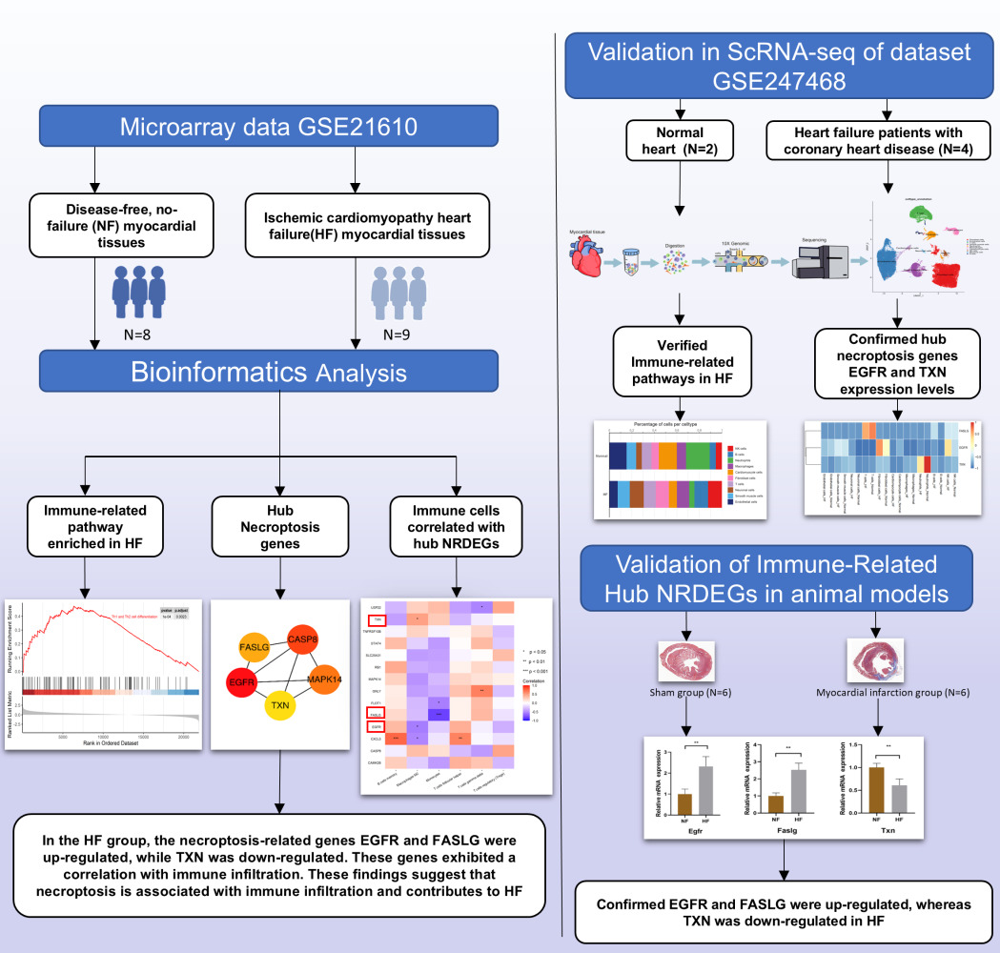

---

# Materials and Methods

The technical scheme of this study is illustrated in @fig-1.

::: {#fig-1 width=100%}

 

Technical workflow schematic of this study.
:::

---

---

<table class="nav-table" width="100%">
  <tr>
    <td align="left">
      [Home](index.qmd) | [About](about.qmd) | [Results](results.qmd)
    </td>
    <td align="right">
      [Start Analysis](analysis/Part_1_Data_acquisition_and_preprocessing.qmd)
    </td>
  </tr>
</table>