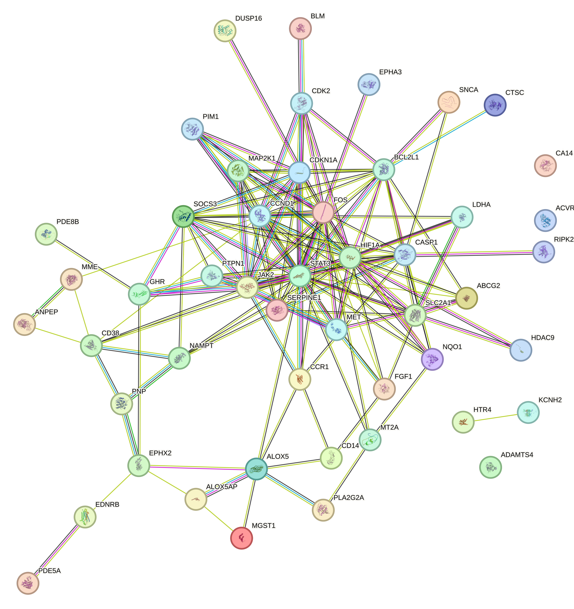

```{r setup, include=FALSE, warning=FALSE}
knitr::opts_chunk$set(
  echo = TRUE,
  warning = FALSE,
  message = FALSE,
  fig.dpi = 300,
  fig.align = "center"
)

options(timeout = 36000)
options(stringsAsFactors = FALSE)
options(download.file.method = "curl")
options(download.file.extra = "-k -L")

options(BioC_mirror = "https://mirrors.tuna.tsinghua.edu.cn/bioconductor")
options(repos = c(CRAN = "https://mirrors.tuna.tsinghua.edu.cn/CRAN/"))
```

---

# PPI network

## Step 1: Obtain the PPI network from the STRING database
```{r}
rm(list = ls())

load("../data/processed/network/01_herb_disease_genes.RData")

# candidate_genes <- c(
#   "MGST1","SNCA","ABCG2","CD14","SOCS3","STAT3","ALOX5","CDKN1A","CTSC","NQO1",
#   "SERPINE1","FOS","BLM","CA14","PDE5A","FGF1","MME","ANPEP","PLA2G2A","ALOX5AP",
#   "CCR1","MAPK10","JAK2","EDNRB","PNP","HTR4","PDE8B","SLC2A1","EPHX2","CD38",
#   "ADAMTS4","NAMPT","HIF1A","MAP2K1","GHR","MT2A","BCL2L1","PTPN1","LDHA","KCNH2",
#   "MET","CCND1","CDK2","CASP1","PIM1","EPHA3","HDAC9","ACVRL1","RIPK2"
# )
# 
# candidate_genes_df <- data.frame(Gene = candidate_genes)


gene_list <- candidate_genes_df$Gene
ppi_list <- clusterProfiler::getPPI(gene_list, taxID = "9606",required_score = 400)

save(ppi_list,file = "../data/processed/network/04_ppi_list.RData")
```

## Step 2: PPI network construction data preparation
```{r}
nodes <- data.frame(id = igraph::V(ppi_list)$name)
nodes$degree <- igraph::degree(ppi_list)

edges <- igraph::as_data_frame(ppi_list, what = "edges")
colnames(edges)[colnames(edges) == "from"] <- "source"
colnames(edges)[colnames(edges) == "to"]   <- "target"
# add an "interaction" column to edges
if(!"interaction" %in% colnames(edges)){
    edges$interaction <- "interacts with"
}

save(nodes,edges,file = "../data/processed/network/05_ppi_network.RData")
```

## Step 3: PPI network visualization
```{r}
# Ping Cytoscape 
cytoscapePing() 

try(deleteNetwork("HFrEF_PPI_Network"), silent = TRUE)
deleteAllNetworks() 

createNetworkFromDataFrames(
  nodes = nodes,  
  edges = edges,  
  title = "HFrEF_PPI_Network", 
  collection = "PPI_Network" 
)

# Create based on degree values, node attributes must be synchronized into Cytoscape first

loadTableData(nodes, data.key.column = "id", table = "node")

# New style
try(deleteVisualStyle("PPI_Style_By_Nodes_Degree"), silent = TRUE)
style_name <- "PPI_Style_By_Nodes_Degree"

# default style
default_lists <- list(
  NODE_SHAPE = "ellipse",           
  NODE_SIZE = 40,                   
  NODE_FILL_COLOR = "#88CCEE",      
  # NODE_LABEL_FONT_SIZE = 12,
  NODE_LABEL_FONT_FACE = "Arial,plain,12",  
  EDGE_WIDTH = 0.5,
  EDGE_STROKE_COLOR = "#E0E0E0",
  EDGE_TRANSPARENCY = 200          
)

mapping_lists <- list(
  # Node size: small degree → 20, large degree → 100
  mapVisualProperty(
    visual.prop = 'node size', 
    table.column = 'degree', 
    mapping.type = 'c',  
    table.column.values = c(min(nodes$degree), max(nodes$degree)), 
    visual.prop.values = c(20, 100)
  ),
  # Node fill color mapping: small degree → light yellow, large degree → red
  mapVisualProperty(
    visual.prop = 'node fill color', 
    table.column = 'degree', 
    mapping.type = 'c',
    table.column.values = c(min(nodes$degree), max(nodes$degree)),
    visual.prop.values = c("#FFFFCC", "#CC0000")
  )
)

createVisualStyle(
  style.name = style_name,
  defaults = default_lists,
  mappings = mapping_lists
)

setVisualStyle(style_name)

# Node Label
setNodeLabelMapping(table.column = 'id', style.name = style_name)

layoutNetwork("force-directed")
```

---

# Figure 4A. PPI network



# Identification of Hub Genes

- input: cytohubba_res.csv

## Step 1: Cytohubba
```{r}
cytohubba_res <- read_csv("../data/processed/network/06_cytohubba_res.csv") %>%
  column_to_rownames(var = colnames(.)[1])

cytohubba_res <- read_csv("../tables/cytohubba.csv") %>%
  column_to_rownames(var = colnames(.)[1])

# cytohubba
top_n <- 20
n <- min(top_n, nrow(cytohubba_res))

top_mcc <- rownames(cytohubba_res[order(cytohubba_res$MCC, decreasing = TRUE), ])[1:n]

top_degree <- rownames(cytohubba_res[order(cytohubba_res$Degree,decreasing = T),])[1:n]

top_mnc <- rownames(cytohubba_res[order(cytohubba_res$MNC,decreasing = T),])[1:n]

cytohubba_hub <- Reduce(intersect, list(top_mcc, top_degree, top_mnc))

cytohubba_hub
```

## Figure 4B

- input: Figure_4B_a, Figure_4B_b,Figure_4B_c
```{r}
# Figure 4B_d
gene_list <- list(
  MCC = top_mcc,
  MNC = top_mnc,
  Degree = top_degree
)

library(ggsci)
library(ggvenn)

p <- ggvenn(
  gene_list,
  fill_color = pal_aaas()(3),
  stroke_color = "white",
  stroke_size = 0.5,
  set_name_size = 2.5,
  text_size = 2.5,
  text_color = "white",
  show_percentage = FALSE
) +
  theme(plot.title = element_text(hjust = 0.5, size=4))

ggsave("../figures/main/nFigure_4B_d.pdf", p, width=1.38, height=1.38, units="in", dpi=300)

# Figure 4B

library(magick)

total_width_cm <- 7        
dpi <- 300                    
px_per_cm <- dpi / 2.54  

files <- c(
  "../figures/main/nFigure_4B_a.pdf",
  "../figures/main/nFigure_4B_b.pdf",
  "../figures/main/nFigure_4B_c.pdf",
  "../figures/main/nFigure_4B_d.pdf"
)

labels <- c("a", "b", "c", "d")

label_size <- 8   

pdfs <- list()
for (i in seq_along(files)) {
  img <- image_read_pdf(files[i], density = 300)
  img <- image_annotate(img, labels[i], 
                        gravity = "northwest",  
                        location = "+5+5",    
                        size = label_size,     
                        weight = 700,    
                        color = "black")
  pdfs[[i]] <- img
}

row1 <- image_append(c(pdfs[[1]], pdfs[[2]]), stack = FALSE)
row2 <- image_append(c(pdfs[[3]], pdfs[[4]]), stack = FALSE)

combined <- image_append(c(row1, row2), stack = TRUE)


image_write(combined, "../figures/main/nFigure_4B.pdf", format = "pdf")
image_write(combined, "../figures/main/nFigure_4B.png", format = "png", density = dpi)
```

## Step 2: MCODE
```{r}
mcode_hub <- data.table::fread("../data/processed/network/07_mcode_res.txt") %>%
  dplyr::slice(1) %>%                   
  dplyr::select(last_col()) %>%          
  dplyr::pull(1) %>%                     
  strsplit(",\\s*") %>%         
  unlist() 

# intersect
hub_genes <- Reduce(intersect, list(top_mcc, top_degree, top_mnc,mcode_hub))

hub_genes_tbl <- cytohubba_res[rownames(cytohubba_res) %in% hub_genes, c("MCC","MNC","Degree")] %>%
  mutate(MCC = as.numeric(MCC)) %>%
  arrange(desc(MCC)) %>%
    rownames_to_column("Gene")

hub_genes_tbl

hub_genes <- hub_genes_tbl$Gene

hub_genes

save(hub_genes_tbl,hub_genes,top_mcc,top_degree,top_mnc, 
     file = "../data/processed/network/08_hub_genes.RData")

write.xlsx(
  hub_genes_tbl,
  "../tables/Table_S5.xlsx"
)
```

## Step 3: Visualization
```{r}
gene_list <- list(
  MCC = top_mcc,
  MNC = top_mnc,
  Degree = top_degree,
  MCODE = mcode_hub
)

library(ggsci)
library(ggvenn)

p <- ggvenn(
  gene_list,
  fill_color = pal_aaas()(4),
  stroke_color = "white",
  stroke_size = 1,
  set_name_size = 5,
  text_size = 5,
  text_color = "white",
  show_percentage = FALSE
) +
  theme(
    text = element_text(family = "serif", size = 10),
    plot.title = element_text(hjust = 0.5, size=10)
    )

# save
ggsave("../figures/main/Figure_4D.pdf", p, width=2.76, height=2.76, units="in", dpi=300)
ggsave("../figures/main/Figure_4D.png", p, width=2.76, height=2.76, units="in", dpi=300)
```

# Figure 4
```{r}
library(magick)

total_width_cm <- 14        
dpi <- 300                    
px_per_cm <- dpi / 2.54     
total_width_px <- round(total_width_cm * px_per_cm) 

ratios_row1 <- c(1, 1)
ratios_row2 <- c(1, 1)  

width_row1_left  <- round(total_width_px * ratios_row1[1] / sum(ratios_row1))
width_row1_right <- round(total_width_px * ratios_row1[2] / sum(ratios_row1))
width_row2_left  <- round(total_width_px * ratios_row2[1] / sum(ratios_row2))
width_row2_right <- round(total_width_px * ratios_row2[2] / sum(ratios_row2))

ratio <- c(width_row1_left,width_row1_right,width_row2_left,width_row2_right)

files <- c(
  "../figures/main/Figure_4A.pdf",
  "../figures/main/Figure_4B.pdf",
  "../figures/main/Figure_4C.pdf",
  "../figures/main/Figure_4D.pdf"
)

labels <- c("A", "B", "C", "D")

label_size <- 12   

pdfs <- list()
for (i in seq_along(files)) {
  img <- image_read_pdf(files[i], density = 300)
  img <- image_resize(img,ratio[i])
  img <- image_annotate(img, labels[i], 
                        gravity = "northwest",  
                        location = "+10+10",    
                        size = label_size,     
                        weight = 700,    
                        color = "black")
  pdfs[[i]] <- img
}

row1 <- image_append(c(pdfs[[1]], pdfs[[2]]), stack = FALSE)
row2 <- image_append(c(pdfs[[3]], pdfs[[4]]), stack = FALSE)

combined <- image_append(c(row1, row2), stack = TRUE)


image_write(combined, "../figures/main/Figure_4.pdf", format = "pdf")
image_write(combined, "../figures/main/Figure_4.png", format = "png", density = dpi)
```
