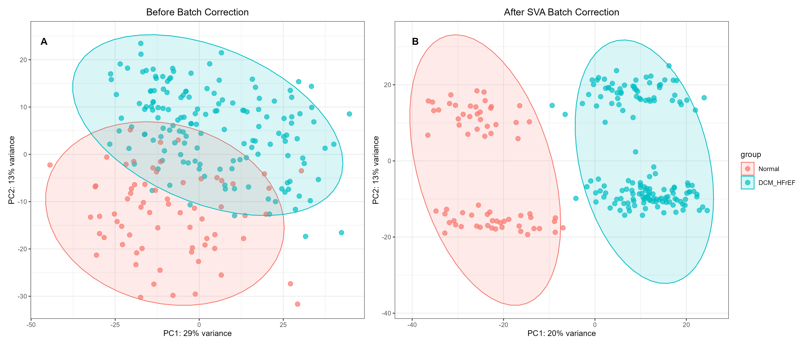

# Methods

## Batch Correction Using Surrogate Variable Analysis (SVA)
To account for potential batch effects and unwanted variation in the expression data, Surrogate Variable Analysis (SVA) was performed using the `sva` package in R. Briefly, the null model was defined to include only the covariates of interest (disease status: DCM-HFrEF vs. normal control), and the alternative model included both the covariates of interest and potential surrogate variables. The number of surrogate variables to include was determined using the `svaseq` function with default parameters. The identified surrogate variables were then incorporated into the linear model to adjust the expression matrix for unwanted variation, resulting in a batch-corrected expression matrix that was used for all subsequent analyses.

## Principal Component Analysis (PCA)
Principal component analysis was performed on the normalized gene expression matrix to visualize global gene expression patterns and assess the similarity between samples. The analysis was conducted using the `prcomp` function in R, and the results were visualized using the `ggplot2` package. The percentage of variance explained by the first two principal components (PC1 and PC2) was reported, and 95% confidence ellipses were drawn for each group to illustrate the distribution and separation of samples.

# Figures

## Figure S1. PCA of the GSE141910 subset before and after SVA-based batch correction.

To assess the global transcriptomic profiles and the efficacy of batch correction, we performed principal component analysis (PCA) on the normalized expression matrix before and after Surrogate Variable Analysis (SVA) adjustment (@suppfig-1).
Before batch correction, the PCA plot showed extensive overlap between the DCM-HFrEF and normal control groups, with their 95% confidence ellipses intersecting broadly (@suppfig-1 A). The first two principal components (PC1 and PC2) explained 29% and 13% of the total variance, respectively. The pronounced mixing of samples indicated that significant unwanted variation, likely of technical origin, obscured the true biological separation between the two cohorts.
Following SVA-based batch correction, the two groups achieved clear spatial separation (@suppfig-1 B). Normal control samples clustered predominantly on the negative side of PC1, while DCM-HFrEF samples occupied the positive side, with no substantial overlap between their 95% confidence ellipses. PC1 and PC2 explained 20% and 13% of the total variance, respectively. While the vast majority of samples were enclosed within their respective 95% confidence ellipses, a small number of individual samples fell outside these boundaries, reflecting the inherent biological heterogeneity expected in clinical cohorts. Collectively, these results demonstrate that SVA effectively removed batch-related artifacts, recovered the distinct molecular signatures associated with DCM-HFrEF, and provided a high-quality, reliable dataset for subsequent bioinformatic analyses.

::: {#suppfig-1}

Principal component analysis (PCA) of  the selected subset of GSE141910 before and after batch correction.
A: PCA before batch correction, B: PCA after SVA-based batch correction

:::

# Tables

---

<table class="nav-table" width="100%">
  <tr>
    <td align="left">
      [Home](index.qmd) | [About](about.qmd) | [Methods](methods.qmd)
    </td>
    <td align="right">
      [Start Analysis](analysis/Part_1_Data_acquisition_and_preprocessing.qmd)
    </td>
  </tr>
</table>

# References {-}

