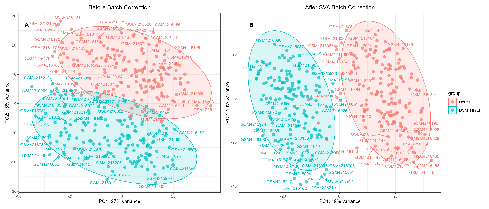

# **Supplementary Figure Legends**

- **Figure S1: PCA plots before and after batch effect correction.**
(A) Before batch correction; (B) After batch correction. The proportion of variance explained by PC1 and PC2 is indicated on the axes.

- **Figure S2: Soft‑thresholding power determination and module identification in WGCNA.**
(Left) Scale‑free fit index as a function of soft‑thresholding power; (Right) Mean connectivity as a function of soft‑thresholding power.

- **Figure S3: Complete directed acyclic graphs (DAGs) for GO enrichment.**
Separate DAGs for biological process (BP), cellular component (CC), and molecular function (MF). Node color indicates enrichment significance.

- **Figure S4: Complete bubble plot of all significant KEGG pathways.**
All pathways with adjusted p‑value < 0.05 are shown. Bubble size represents gene count; color represents adjusted p‑value.

- **Figure S5: Variable selection plots for four machine learning algorithms.**
(A) LASSO cross‑validation (lambda.min and lambda.1se). (B) SVM‑RFE accuracy curve. (C) Boruta feature importance (shadow features). (D) XGBoost feature importance (Gain).

- **Figure S6: Cell type annotation of the single‑cell dataset.**
Left: UMAP embedding of all cells with cluster annotation. Right: dot plot of marker gene expression for each cluster. 

::: {#suppfig-1}

Differential gene expression analysis.
A: Volcano plot showing the distribution of all expressed genes. Red dots represent significantly upregulated genes, blue dots represent significantly downregulated genes, and gray dots represent non-significant genes.
B: Heatmap displaying the expression patterns of the top 100 upregulated and top 100 downregulated DEGs. Samples are arranged with heart failure samples on the left and normal samples on the right.
:::

# **Supplementary Tables**

See `supplementary/Supp_Tables.xlsx`

- **Table S1: Composition of formula compounds.**
  – Columns: Herb, Molecule name, IUPAC Name, Molecular formula, Molecular weight, PubChem CID, SMILES
  
- **Table S2: Candidate drug targets.**
  – Columns: Target gene name, UniProt ID, Prediction platform (SwissTargetPrediction, STITCH, etc.), Included in intersection (Yes/No)
  
- **Table S3: Candidate disease targets.**
  – Columns: Gene name, log2FC, adj. P‑value, DEG direction (up/down), WGCNA module assignment, Included in intersection (Yes/No)
  
- **Table S4: Full process of drug–disease target screening.**
  – Columns: Gene name, CytoHubba scores for four algorithms, MCODE cluster ID, Hub gene (Yes/No), Final core gene (Yes/No)
  
- **Table S5: Performance metrics of the diagnostic model based on core genes.**

  - Columns: Dataset (training/test/validation1/validation2/…), Sample size (n), AUC (95% CI), Sensitivity, Specificity, Accuracy, Positive predictive value, Negative predictive value, F1 score

